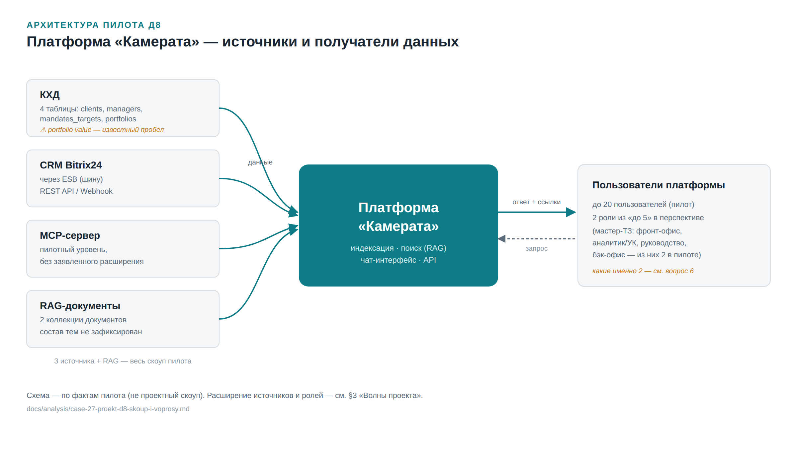

# Скоуп проекта Д8 (Кейс 2 методики) — рабочий разбор и вопросы к заказчику

**Контекст:** применение методики внедрения (`docs/metodika-vnedreniya.md`, Кейс 2 — Проект) к конкретному кандидату — АО «Инвестиционная компания Д8», единственному клиенту в базе, реально прошедшему пилот достаточно далеко, чтобы обсуждать масштабирование. Ниже — то, что уже известно из пилотного ТЗ и разбора мастер-ТЗ, что подтвердил заказчик в этой сессии, черновая карта волн проекта, и открытые вопросы, которые нужно закрыть до фазы П2 («Целевая архитектура и волны роллаута»).

---

## Главные тезисы

- **Скоуп пилота остаётся полностью** — КХД, ESB/CRM Bitrix24 и MCP-сервер никуда не выводятся. **Расширяются только ESB и КХД** (больше витрин и API, возможно шире периметр хранилища); «RAG-компании» исключён из скоупа как опечатка/дублирующее название (§1–2).
- **Волны 1 и 2 подтверждены по порядку, но не по содержанию.** Заказчик задал последовательность (сначала RAG-документы, потом КХД/ESB), но формулировка волны 1 допускает три разных толкования, а точный состав волны 2 (какие витрины/API) не назван. Волна 3+ полностью открыта — «уточнить какие дальше» (§3).
- **Без 4 параметров по каждой волне трудоёмкость не оценить**: состав данных, количество витрин/коллекций, количество пользователей, количество ролей. Это не опция, а условие для старта фазы П2 — детальный чек-лист и рабочий шаблон сбора данных см. в §3.
- **Из 11 пунктов реестра платформенных пожеланий Д8 нужно ответить только по 4** («требуется от Д8») — остальные 7 либо уже в плане платформы на конкретный квартал, либо решаются внутри команды без участия заказчика (§4).
- **К заказчику — 18 вопросов и 6 наших предложений** с рабочей позицией по умолчанию (проще поправить готовое предложение, чем отвечать с нуля) — §5–6. Три из них — не про содержание волны, а прямой запрос к заказчику назвать **цель волны и критерий её достижения** (вопросы 2, 4, 8) — это должен сформулировать Д8, а не мы за него.
- **Критично закрыть звонком, не перепиской:** точное толкование волны 1 (три варианта слишком разные по объёму работ) — предложение 1 в §6.
- **Пилот формально не прошёл все пороги приёмки** (Сценарий 6: 67,4%/70%, Сценарий 4: 87,5%/95%, `case-21`) — предлагаем не ждать дозакрытия, а перенести оба пункта в список долга бизнес-кейса П1 (предложение 6, §6, вопрос 18).
- **Архитектура пилота задокументирована отдельно** (см. ниже) как факт-базис для сравнения с проектным расширением — не проектный скоуп.

---

## 1. Что уже известно (из пилотного ТЗ и мастер-ТЗ)

### Скоуп пилота (для сравнения)

3 источника данных (КХД, CRM Bitrix24 через ESB, MCP-сервер), 2 согласованные роли из «до 5 в перспективе», 2 коллекции документов, до 20 пилотных пользователей.

Пилотное ТЗ изначально называло и четвёртый источник — «RAG-компании» — как отдельный пункт с открытым статусом (`case-03-pilot-tz-ai-guard.md:29,83`: «не до конца ясно, идёт ли речь о самостоятельном RAG-продукте Д8... или это просто дублирующее название той же платформы»). **Резолюция 14.09.2026:** заказчик считает это, скорее всего, опечаткой/дублирующим названием, не отдельной системой — убрано из скоупа как самостоятельный источник (подробнее — §2).

### Полный ландшафт по мастер-ТЗ (`docs/sources/tz-rag-investment.pdf`, §1.2–1.3) — шире пилота

| Источник | Критичность | Подключение | В пилоте? |
|---|---|---|---|
| CRM Bitrix24 | Критический | REST API/Webhook | Да (через ESB) |
| Excel/CSV (портфели, AUM/AUC, P&L, сделки, отчёты) | Критический | SMB | Не подтверждено |
| Word/PDF (декларации, договоры ДУ, меморандумы, регламенты) | Высокий | SMB | Не подтверждено |
| Email (входящие/исходящие) | Низкий | IMAP/MS Graph API | Нет — Must Have в ТЗ, но 0 тест-кейсов TC-EMAIL |
| Внутренние регламенты (compliance) | Средний | Word/PDF папка | Не подтверждено |
| Back office (сделки, документы) | Критический | — | Не подтверждено |
| Confluence (база знаний) | Высокий | Confluence | Нет |

Роли по мастер-ТЗ (§1.3): Менеджер фронт-офиса (10–20 чел), Аналитик/Портфельный управляющий (5–10 чел), Руководство (3–7 чел), Бэк-офис (5–10 чел) — суммарно ориентировочно 23–47 человек против пилотных «до 20 пользователей» и 2 активных ролей.

**Явно отложено в мастер-ТЗ (п. 3.2, дословно):** «Разграничение прав: compliance видит свои документы, менеджер — своих клиентов (опционально в v2)» — то есть построчная сегрегация доступа внутри роли сейчас не гарантирована даже логически, не только по факту пилота.

**Важно:** ни в одном документе базы нет фактической оргструктуры/штата Д8 — таблица ролей выше взята из мастер-ТЗ и не сверялась с реальными подразделениями (см. `case-20-katalog-tree-critic-verdict.md`). Это не факт, а лучшее доступное приближение.

---

## 2. Подтверждено заказчиком в этой сессии (13–14.09.2026)

Все 3 пилотных источника (КХД, ESB/CRM Bitrix24, MCP-сервер) **остаются в скоупе проекта** — ничего из них не выводится. **ESB и КХД — основные каналы, которые расширяются**: больше витрин данных и больше API внутри шины, плюс, видимо, более широкий периметр самого хранилища. MCP-сервер остаётся в проекте как есть, на пилотном уровне — без заявленного расширения (если не появится отдельного запроса).

**Резолюция по «RAG-компании»:** заказчик подтвердил, что формулировка в пилотном ТЗ — скорее всего опечатка или дублирующее название пилотного контура, а не отдельная система. Убрано из скоупа как самостоятельный источник; снимает открытый вопрос, тянувшийся с пилотного ТЗ.

Источники из мастер-ТЗ, не входившие в пилот (Excel/CSV напрямую, Email, Confluence, отдельный back-office-коннектор) — по-прежнему не подтверждены и не затронуты этим решением ни в одну, ни в другую сторону (см. вопрос 12).

---

## Архитектура пилота

Платформа в центре, источники данных слева (подключаются к ней), получатели — пользователи и их запросы — справа. Схема строго по фактам пилота (§1–2), не по проектному скоупу — расширение источников и ролей описано ниже, в §3.

---

## 3. Волны проекта — черновая карта (главный открытый вопрос)

Заказчик задал порядок первых двух волн; дальнейшие волны прямо помечены как требующие уточнения.

| Волна | Содержание | Статус |
|---|---|---|
| 1 | RAG-документы | Порядок подтверждён заказчиком; точное содержание волны требует уточнения — см. ниже |
| 2 | Расширение КХД и ESB (шины) | Подтверждено заказчиком (см. §2) — больше витрин и API в шине, возможно расширение периметра КХД |
| 3+ | Не определено | Заказчик прямо отметил: «уточнить какие дальше» |

### Волна 1 — «RAG-документы»: что нужно уточнить

Формулировка допускает минимум три разных толкования — их не стоит смешивать без явного уточнения у заказчика:

- **(а) Расширение самого документного корпуса** — добавление типов документов, не входивших в пилот: Word/PDF из мастер-ТЗ (декларации, договоры ДУ, меморандумы, внутренние регламенты — §1.2, статус «не подтверждено»). Если это имелось в виду — волна 1 частично закрывает вопрос 12 ниже (Word/PDF-регламенты).
- **(б) Улучшение качества и покрытия уже подключённых RAG-коллекций пилота** (их 2) — без добавления новых типов документов, а работа над полнотой/актуальностью того, что уже загружено.
- **(в) Технически новая RAG-коллекция** под конкретное подразделение или задачу, отдельная от двух пилотных.

Рекомендуем закрыть это тем же способом, что и вопрос про «RAG-компании» — коротким уточняющим созвоном, а не перепиской, поскольку от ответа зависит, входит ли волна 1 в периметр методического этапа П2 (архитектура) или это отдельная, более узкая задача каталогизации/загрузки контента.

### Волна 2 — Расширение КХД и ESB

Содержание уже описано в §2. Технические открытые вопросы по этой волне — вопросы 5–8 в §5.

### Волна 3+ — открыто, кандидаты для обсуждения

Заказчик явно оставил это открытым. Ниже — не решение, а материал для следующего разговора (кандидаты, исходя из известного контекста):

- Роллаут на новые роли/подразделения (аналитики/портфельные управляющие → руководство → бэк-офис) — см. предложение 5 в §6.
- Переход на динамические права доступа (вопрос 11), если к этому моменту готова платформенная сторона (реестр §4).
- Источники вне пилотной тройки (Email/Confluence/Excel-CSV) — если по вопросу 12 заказчик подтвердит их актуальность.
- Промышленная эксплуатация (фаза П4 методики) — начинается не как отдельная волна, а как переход в режим SLA после того, как первые волны приняты.

### Чек-лист: данные для оценки скоупа волны

Оба вопроса «что входит в волну» (§5, вопросы 1 и 5) сейчас сформулированы как открытые — они спрашивают **что**, но не **сколько**. Без числовых параметров ниже нельзя оценить трудоёмкость волны даже приблизительно (а Кейс 2 методики и так не даёт оценок трудоёмкости из-за отсутствия прецедента — см. `docs/metodika-vnedreniya.md`, §4.3; закрыть эти 4 параметра — необходимое условие, чтобы вообще начать оценку, когда проект перейдёт в фазу П2).

Четыре параметра нужны для любой волны независимо от типа источника:

1. **Состав данных** — что технически входит (домен, конкретные сущности)
2. **Количество витрин / коллекций** — единица учёта объёма
3. **Количество пользователей** — кто получит доступ именно в рамках этой волны
4. **Количество ролей** — сколько ролевых профилей затронуто

#### Для КХД / ESB (волна 2)

| Параметр | Известно (пилот) | Нужно уточнить у Д8 | Вопрос |
|---|---|---|---|
| Состав данных | 4 таблицы: `crm.crm.crm.clients`, `crm.crm.crm.managers`, `trade.trade.trading.mandates_targets`, `trade.trade.trading.portfolios` (у последней — известный пробел: значение портфеля не находится, хотя источник подключён, см. `case-01-d8-014-brief.md`) | Новые витрины/таблицы: домен, ключевые поля, владелец на стороне Д8, объём (строк / размер) | Вопрос 5 |
| Количество витрин | 4 (пилот) | Точное число витрин сверх пилотных 4 — сейчас вопрос 5 спрашивает список, но не просит явно назвать количество | Вопрос 5 — дополнить формулировку |
| API в шине | 1 интеграция: CRM Bitrix24, REST API/Webhook | Список новых API: система-источник, формат (REST/SOAP/др.), ответственный на стороне Д8 за контракт | Вопрос 6 |
| Количество пользователей | до 20 (пилот, все роли вместе) | Сколько пользователей получат доступ именно к расширенным данным волны 2 — не общий штат, а конкретный контур волны | Новый пункт — добавить к вопросу 9 |
| Количество ролей | 2 из «до 5» по пилотному ТЗ | Волна 2 работает в рамках тех же 2 ролей, что пилот, или подключает новые | Вопрос 9 |

#### Для RAG (волна 1)

| Параметр | Известно (пилот) | Нужно уточнить у Д8 | Вопрос |
|---|---|---|---|
| Состав данных | 2 RAG-коллекции пилота (конкретная тематика документов не зафиксирована ни в одном кейсе базы) | Зависит от толкования (а/б/в выше): при (а) — какие именно типы документов добавляются (кандидаты из мастер-ТЗ §1.2: договоры ДУ, декларации, меморандумы, внутренние регламенты) | Вопрос 1 |
| Количество коллекций | 2 (пилот) | Волна 1 расширяет существующие 2 коллекции или создаёт новые — и если новые, сколько | Вопрос 1 — дополнить формулировку |
| Количество документов | Не зафиксировано — объём пилотного корпуса неизвестен по имеющимся кейсам | Оценка объёма: количество документов, средний размер, темп прироста (важно для оценки индексации и стоимости хранения) | Новый пункт — добавить к вопросу 1 |
| Количество пользователей | до 20 (пилот) | Тот же контур пользователей, что в пилоте, или волна 1 открывает доступ новым | Новый пункт — добавить к вопросу 9 |
| Количество ролей | 2 (пилот) | Какие роли получают доступ к волне 1 | Вопрос 9 |

**Как использовать:** это рабочий шаблон сбора данных, не готовый вопрос заказчику — заполняется по итогам созвона по волне 1 (предложение 1, §6) и по ответам на вопросы 5–9. Тот же шаблон (4 параметра) переиспользуется для волны 3+, когда её содержание определится.

---

## 4. Реестр открытых платформенных пунктов (скриншот трекера, эта сессия)

Транскрипция таблицы, присланной пользователем — статус/приоритет платформенных возможностей, релевантных для оценки готовности к проекту Д8. Дополнена (14.09.2026) колонками «Квартал» (срок на стороне платформы) и «Уточнение» (что уже помечено как требующее уточнения у заказчика):

| Статус | Пункт | Приоритет | Квартал | Уточнение |
|---|---|---|---|---|
| В плане | Мультидоменная авторизация | Критичный | 4 квартал | — |
| — | Работа с MS Office 365 | Нормальный | 4 квартал | — |
| Выяснить про search API | Поддержка актуальной версии API Claude (web search и т.п.) | Критичный | — | Уточняем (на стороне платформы) |
| Кастомизация выбора источников | Возможность подключения/отключения источников данных внутри компании при работе в режиме чата и через API | Нормальный | — | Уточнить у заказчика |
| — | Отмечать замены в анонимизируемых данных для пользовательских правил не как CUSTOM_N, а с разными наименованиями для разных правил | Нормальный | 4 квартал | — |
| — | Обновление данных в RAG-ах через API. Базы знаний ведутся в других источниках, нужны автоматические процедуры по поддержанию в актуальном состоянии баз знаний в ИИ платформе | Высокий | 4 квартал | — |
| Требует проработки | Обновление информации о правах доступа сотрудников к данным внутри таблиц. Сейчас — только по фиксированному списку из политик доступа. Нужно, чтобы данные получались через таблицы/API — права динамические и могут регулярно меняться | Высокий | — | Уточнить у заказчика |
| Требует проработки (визуал) | Работа с графиками — проблемы в отображении данных, есть планы по красоте отображения, пока не хочется оставлять как целевой вариант | Нормальный | 4 квартал — 1 квартал 2027 | — |
| Требует проработки | Дать пользователям возможность создавать RAG и делиться ими с сотрудниками — персональные коллекции у пользователя, а не набор файлов как сейчас. Выводить документы в фильтры для пользователя при выборе источника запроса | Нормальный | — | Уточнить у заказчика |
| В работе | Пользовательская и админская документация на систему | Высокий | 4 квартал | — |
| — | Упрощение заведения пользователей | Нормальный | — | Уточнить у заказчика |

**Прямая связь с волной 2 (§3) / решением по ESB (§2) — с поправкой на сроки:**
- «Обновление данных в RAG-ах через API» (высокий) — **уже в плане на 4 квартал**, платформенная сторона не блокирует старт волны 2 в ожидаемые сроки.
- «Обновление информации о правах доступа... через таблицы/API» (высокий) — сроков пока нет, статус «Уточнить у заказчика». Это более реальный риск-фактор для волны 2 (и особенно для чувствительных волн 3+), чем первый пункт — см. пересмотренное предложение 4 в §6.

**Из 11 пунктов реестра только 4 помечены «Уточнить у заказчика»** — именно они (и только они) взяты в список вопросов ниже (§5, раздел «Платформенные возможности»). Остальные 7 — либо уже запланированы платформой на конкретный квартал (мультидоменная авторизация, MS Office 365, обновление RAG через API, визуал графиков, документация, кастомные наименования замен), либо в статусе «Уточняем» силами самой платформенной команды, не требуют ответа от заказчика (поддержка API Claude/search) — вынесены из вопросов заказчику, чтобы не задавать то, что уже решается без него.

---

## 5. Список вопросов к заказчику (Д8)

### Волны проекта

1. Волна 1 «RAG-документы» — что именно имеется в виду: (а) новые типы документов сверх пилотных двух коллекций, (б) улучшение качества/покрытия уже загруженного, или (в) отдельная новая коллекция под конкретную задачу/подразделение? Для оценки объёма: сколько коллекций в результате (расширяются существующие 2 или добавляются новые — и сколько), и примерный объём корпуса (количество документов, средний размер, темп прироста).
2. **Цель и критерий волны 1** — какой результат для бизнеса должна дать волна 1: что именно изменится для пользователей или процессов? По каким признакам вы будете считать волну 1 завершённой и успешной? *(это должен сформулировать Д8 — не готовая формулировка от нас, а прямой запрос к заказчику)*
3. Волна 3 и далее — есть ли уже примерное направление (роли, новые источники, промышленная эксплуатация), или это открытый вопрос до завершения волны 2?
4. **Цель и критерий волны 3+** — когда направление определится, какая бизнес-цель будет стоять за этой волной, и какими критериями вы будете руководствоваться при выборе (что считать успехом)?

### Интеграция (ESB / КХД, волна 2)

5. Какие конкретно витрины данных нужно добавить в ESB сверх текущего среза CRM (Bitrix24)? Нужен список с владельцами на стороне Д8 — и явное число: сколько витрин добавляется сверх пилотных 4 (`crm.crm.crm.clients`, `crm.crm.crm.managers`, `trade.trade.trading.mandates_targets`, `trade.trade.trading.portfolios`).
6. Какие конкретно API нужно открыть через шину — по каждому: система-источник, формат (REST/SOAP/др.), кто на стороне Д8 отвечает за контракт API.
7. КХД — расширяется ли состав таблиц/витрин внутри самого хранилища, или его периметр остаётся как в пилоте?
8. **Цель и критерий волны 2** — какую бизнес-задачу решает расширение ESB/КХД: что станет возможным, чего нет сейчас? По какому набору проверок/сценариев вы примете волну 2 как завершённую?

### Права доступа и роли

9. Реальная оргструктура для проекта: список подразделений/ролей с числом пользователей в каждой (не гипотетическая таблица из мастер-ТЗ, а факт) — нужна для карты волн 3+. Отдельно по волнам 1 и 2: сколько пользователей и какие именно роли получают доступ в рамках именно этой волны (не общий штат) — тот же контур, что в пилоте (до 20 пользователей, 2 роли), или шире.
10. Разграничение прав «compliance видит своё, менеджер — своих клиентов» (п. 3.2 мастер-ТЗ, помечено «опционально в v2») — обязательное требование для проекта или можно оставить на будущее?
11. Права доступа сотрудников сейчас фиксированы по статичному списку политик. Для проекта это должно стать динамическим через API — но нужна точная схема процесса: права хранятся и администрируются внутри самой платформы (и меняются там же), или платформа только получает их из внешней системы-источника через API и применяет как есть? Если второе — какая система источник истины (HR-система, Bitrix24, отдельный IAM) и как часто права обновляются? *(= пункт реестра «Обновление информации о правах доступа...», Уточнить у заказчика)*

### Источники данных вне пилотных трёх

12. Email, Word/PDF-регламенты, Confluence из мастер-ТЗ (§1.2) — они не входили в пилот. Подтверждается ли, что они НЕ входят и в проект (за вычетом того, что может решиться толкованием волны 1(а)), или это отдельный вопрос, который ещё предстоит решить?
13. Email в мастер-ТЗ помечен Must Have, но тест-кейсы (TC-EMAIL) отсутствовали уже в пилоте — снимается ли это требование в проекте или переносится?

### Платформенные возможности — только пункты реестра, помеченные «Уточнить у заказчика»

14. Кастомизация выбора источников — нужно уточнить, что именно имеется в виду: (а) подключение/отключение целых каталогов данных внутри домена компании, или (б) выбор персоны/профиля пользователя с отдельным набором прав доступа к источникам? Это разные по объёму реализации задачи.
15. Персональные RAG-коллекции пользователей — нужно уточнить механику: имеется в виду фильтр по документам внутри уже существующей коллекции (сузить область поиска), или отдельная новая коллекция, которую пользователь создаёт и наполняет сам?
16. Упрощение заведения пользователей — нужен не общий запрос, а конкретный кейс: как должен выглядеть процесс пошагово (кто инициирует, какие поля заполняются, кто подтверждает), чтобы платформа могла спроектировать решение по существу.

### Общее по проекту (Кейс 2 методики)

17. Кто со стороны Д8 — новый владелец процесса на фазе П4 (промышленная эксплуатация)? Тот же технический контакт, что в пилоте, или отдельная выделенная роль/команда?
18. Формальный критерий перехода в проект: пилот по `case-21` не прошёл все пороги приёмки (Сценарий 6: 67,4%/70%, Сценарий 4: 87,5%/95%) — Д8 согласен двигаться дальше при текущем результате, или ждём отдельного дозакрытия этих двух пунктов до старта П1?

---

## 6. Наши предложения (не только вопросы — рабочая позиция по умолчанию)

По части вопросов есть смысл не просто спрашивать, а предложить заказчику отправную позицию — легче поправить готовое предложение, чем отвечать на открытый вопрос с нуля.

1. **Волна 1 — закрыть коротким созвоном, не перепиской.** Как и с «RAG-компании» — три возможных толкования (§3) слишком разные по объёму работ, чтобы гадать. Предлагаем этот вопрос первым, до отправки остального списка.

2. **Решение по ESB/КХД (волна 2) зафиксировать письменно как есть — расширение, не сужение.** Предлагаем формулировку для проектного ТЗ: «Все 3 пилотных источника (КХД, ESB/CRM, MCP-сервер) остаются в проекте; ESB и КХД получают расширение (витрины/API), MCP-сервер — на пилотном уровне; «RAG-компании» исключён из скоупа как опечатка/дублирующее название». Источники вне пилотной тройки — отдельный, пока не решённый вопрос (вопрос 12), не путать с этим решением.

3. **Разграничение прав compliance/менеджер — предлагаем переквалифицировать из «опционально в v2» в обязательное для проекта.** Мастер-ТЗ пометил это как опциональное, но Д8 — брокер/инвестиционная компания, и доступ менеджера к чужим клиентам — это не UX-неудобство, а комплаенс-риск. Рекомендуем не спрашивать «нужно ли», а прямо предложить включить в обязательный скоуп и попросить заказчика подтвердить/отклонить, а не решать с нуля.

4. **Динамические права доступа (вопрос 11) — не блокировать волну 2, но зафиксировать как gate для поздних волн.** На стороне платформы срока пока нет («Уточнить у заказчика» в реестре — платформа тоже ждёт ответа Д8). Предлагаем: волну 2 запускать на статичной модели прав (как в пилоте), но заложить в архитектуру совместимость с будущим переходом на API-модель — и явно зафиксировать, что волны с данными повышенной чувствительности (комплаенс, бэк-офис, кандидаты для волны 3+) не начинаются, пока это не готово с обеих сторон (ответ Д8 + реализация платформы). Отдельно: «Обновление данных в RAG через API» — уже в плане платформы на 4 квартал, для этого пункта отдельного вопроса заказчику не нужно, только держать в поле зрения срок.

5. **Для волны 3+, если это роллаут по ролям — предлагаем порядок по умолчанию: фронт-офис → аналитики/портфельные управляющие → руководство → бэк-офис.** Обоснование: фронт-офис — единственная роль, реально протестированная в пилоте (тот же кейс D8-014), значит первая среди ролевых волн — наименьший технический риск. Бэк-офис — последним: самые чувствительные данные (сделки, документы), и именно туда упирается вопрос 11 (динамические права доступа).

6. **Критерий перехода (вопрос 18) — предлагаем не ждать дозакрытия сценариев 6 и 4.** По методике (§4.1 Кейса 2) переход не требует 100% pass. Предлагаем перенести оба открытых пункта в явный «список долга» бизнес-кейса П1 — с обязательством закрыть их в рамках волны 1 или 2, а не тихо забыть при переходе в проект.

---

## См. также

- [`docs/presentations/case-27-proekt-d8-skoup-i-voprosy.pptx`](../presentations/case-27-proekt-d8-skoup-i-voprosy.pptx) — презентация: программа проекта, диаграмма Ганта, реестр предложений, вопросы к заказчику.
- [`docs/analysis/case-27-proekt-d8-skoup-i-voprosy.xlsx`](case-27-proekt-d8-skoup-i-voprosy.xlsx) — рабочая таблица (программа, вопросы, реестр).
- [`docs/metodika-vnedreniya.md`](../metodika-vnedreniya.md) — методика, Кейс 2 (П1–П5).
- [`docs/analysis/case-03-pilot-tz-ai-guard.md`](case-03-pilot-tz-ai-guard.md) — пилотное ТЗ, скоуп пилота и явные ограничения.
- [`docs/analysis/case-02-tz-deep-analysis-and-proposals.md`](case-02-tz-deep-analysis-and-proposals.md) — разбор мастер-ТЗ, полный ландшафт источников/ролей.
- [`docs/analysis/case-21-pereotsenka-scenariev-6-i-4-po-kriteriyam-priemki.md`](case-21-pereotsenka-scenariev-6-i-4-po-kriteriyam-priemki.md) — формальный статус приёмки пилота (вопрос 18).
