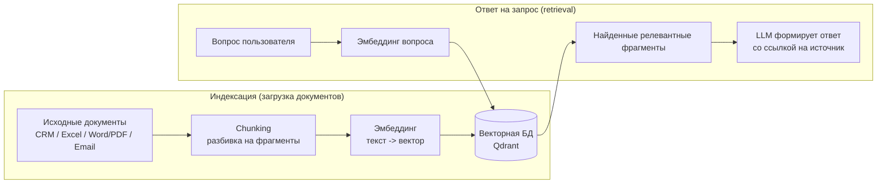

# Загрузка документов в RAG-агента (document ingestion)

## Простыми словами

Это процесс, который превращает документы (файлы, записи в CRM, письма) в форму, в которой агент может быстро находить нужный кусок текста и честно на него сослаться, вместо того чтобы отвечать «из головы».

Работает это в несколько шагов.

## Как это устроено: 5 шагов

### 1. Собрать документы

Берём файлы и записи из источников. В нашем проекте (см. ТЗ, раздел 1.2) это: Excel-таблицы с портфелями и P&L, Word/PDF-регламенты и договоры, письма, записи CRM Bitrix24.

### 2. Разбить на кусочки (chunking)

Большой документ режут на небольшие фрагменты — абзацы, разделы, пункты. Модель не может «переварить» весь договор на 50 страниц при каждом вопросе, поэтому ей проще работать с маленькими, тематически цельными кусками.

Пример из нашего разбора (`case-01-d8-014-brief.md`): регламент `rag_docs/01_reglament_limitov.md` был разбит на фрагменты, и агент доставал именно нужный кусок — «Риск-профили клиентов (BAL — 25%)», — а не весь документ целиком.

### 3. Превратить текст в числа (эмбеддинги)

Каждый фрагмент прогоняют через модель-эмбеддер, которая превращает его смысл в вектор — набор чисел. Тексты, близкие по смыслу, получают близкие по расположению векторы. Это как разложить все фразы по координатам на карте: рядом лежит то, что связано по смыслу, а не по совпадению слов.

### 4. Сохранить в векторную базу (индексация)

Векторы вместе со ссылкой на исходный файл/документ кладутся в специальное хранилище — векторную БД (в ТЗ проекта это Qdrant). Ссылка на источник — то, что потом даёт возможность агенту сказать «источник: такой-то файл», как это происходит в каждом ответе агента в Кейсе 01.

### 5. Обновлять при изменении исходников (синхронизация)

Если документ поменялся (обновили регламент, добавили сделку в Excel), его нужно заново нарезать, превратить в векторы и обновить в базе. Это и есть «синхронизация данных» из НФТ ТЗ (раздел 3.1): полная — не более 2 часов, инкрементальная (по изменениям за сутки) — не более 15 минут.

## Как это используется при ответе на вопрос (retrieval)

Когда пользователь задаёт вопрос, система:

1. превращает сам вопрос в такой же вектор (через ту же модель-эмбеддер);
2. ищет в векторной базе ближайшие по смыслу фрагменты — это и есть «R» (retrieval) в аббревиатуре RAG (Retrieval-Augmented Generation);
3. подкладывает найденные фрагменты языковой модели как контекст, вместе с вопросом;
4. модель формирует ответ, опираясь на эти фрагменты, и указывает источник.

## Термины по теме

| Термин | Что это |
|---|---|
| Chunk (чанк) | Один небольшой фрагмент документа после разбивки — единица, которую индексирует и находит система |
| Эмбеддинг (embedding) | Числовое представление смысла текста (вектор), полученное моделью |
| Векторная база данных | Хранилище, оптимизированное под быстрый поиск ближайших по смыслу векторов (в проекте — Qdrant) |
| Retrieval | Поиск наиболее релевантных фрагментов по вектору вопроса — шаг перед тем, как LLM формирует ответ |
| Индексация | Процесс превращения документов в чанки + эмбеддинги + запись в векторную БД |
| Инкрементальная синхронизация | Обновление индекса только по изменившимся/новым документам, без полной переиндексации всего массива |

## Связь с находками по проекту

- Пробел про версионирование регламентов (`case-02-tz-deep-analysis-and-proposals.md`, п. 2.5): при обновлении регламента старая версия чанка должна корректно замещаться новой, и в идеале ответ должен указывать дату актуальности документа-источника — этого явно не требует текущее ТЗ.
- Требование к точности источника (`case-01-d8-014-brief.md`): именно благодаря индексации со ссылкой на исходный документ агент смог во всех пяти ответах указать конкретную таблицу/файл — это прямое следствие того, что на шаге 4 (индексация) сохраняется не только вектор, но и метаданные об источнике.

## См. также

- [`docs/analysis/case-01-d8-014-brief.md`](../analysis/case-01-d8-014-brief.md)
- [`docs/analysis/case-02-tz-deep-analysis-and-proposals.md`](../analysis/case-02-tz-deep-analysis-and-proposals.md)
