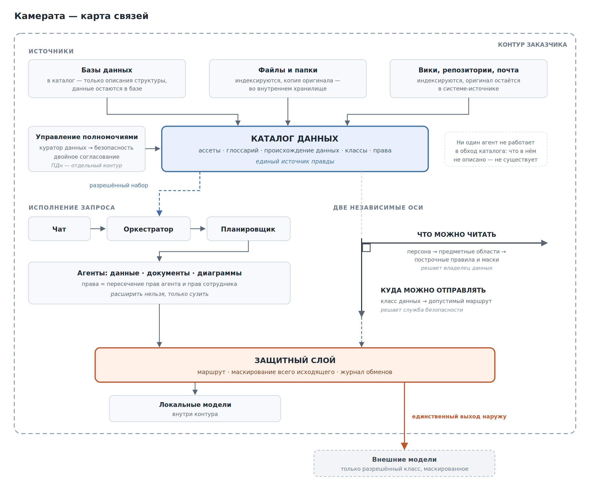

# Камерата — обзор платформы (рабочая версия разработчика)

> **Статус документа.** Рабочая версия, подготовленная для внутреннего
> обзора и согласования. Фрагменты в двойных скобках \[\[ ... \]\] ---
> места, требующие фактических данных от команды: они помечены намеренно
> и должны быть закрыты до передачи документа заказчику.

# Часть A. Обзор

> **Как читать документ.** Часть A (эти несколько страниц) читают все:
> что платформа даёт, как устроена в общих чертах, что потребуется от
> вас и где её границы. Часть B --- приложения с подробным разбором
> каждого понятия, читать выборочно и по мере надобности. Термины вроде
> «RAG» или «эмбеддинг» знать заранее не нужно: всё, что встречается,
> объясняется по ходу.

## A.1. Что это за платформа

**Камерата** --- это единое интеллектуальное рабочее пространство, где
сотрудник задаёт вопрос о данных и документах компании обычным
человеческим языком и сразу получает ответ: число, таблицу, график или
ссылку на нужный документ. Как если бы у каждого подразделения появился
персональный аналитик, который знает, где что лежит, понимает
бизнес-термины компании и при этом **никогда не показывает лишнего** ---
только то, что конкретному сотруднику положено видеть.

Платформа ставится **в контур заказчика**, вплоть до полностью
изолированного, без выхода в интернет. Приоритет номер один --- данные
не покидают периметр.

> **О названии.** Камератой во Флоренции конца XVI века называли
> собрание музыкантов, поэтов и учёных, из опытов которого выросла
> опера. Смысл слова --- не «один солист», а **общество исполнителей**:
> у каждого своя партия, звучат они вместе, и целое получается тем, чего
> никто не сделал бы в одиночку. Платформа устроена так же. За каждым
> ответом стоит не одна ИИ-модель, а несколько узких исполнителей ---
> один обращается к данным, другой ищет по документам, третий строит
> график, --- и отдельный «дирижёр» сводит их партии в один связный
> ответ.

### Чем это отличается от публичного чат-бота

Это первый вопрос, который обычно задают, и ответ на него короткий.

Публичный чат-бот отвечает «из головы» --- из того, чему его обучили на
данных интернета. Он **не знает ваших внутренних документов** и **может
уверенно выдумать** правдоподобный, но неверный ответ. Проверить его
нечем.

Камерата устроена наоборот: прежде чем ответить, платформа идёт в
**ваши** данные и документы, находит нужное и отвечает строго по
найденному --- со ссылкой на источник, который можно открыть и
проверить. Если ответа в ваших данных нет, платформа так и говорит. И на
каждом шаге она знает, **кому** отвечает: сотрудник получает ответ
только по тем данным, к которым у него есть доступ.

## A.2. Зачем она нужна

**Проблема.** Данные компании разбросаны: базы, хранилища, папки с
договорами, регламенты, должностные инструкции. Чтобы получить ответ,
нужно знать, где искать, уметь писать запросы к базам и держать в
голове, кому что можно показывать. Обычный сотрудник так не умеет --- и
идёт к аналитику или в ИТ, теряя дни.

**Что даёт платформа:**

-   **Ответы на естественном языке** --- «сколько сделок по Уралу за
    квартал» → число и график, без SQL и без аналитика.
-   **Поиск по документам** --- «что в регламенте про оформление
    отпуска» → ответ по тексту регламента со ссылкой на конкретный
    раздел.
-   **Ответы строго по вашим источникам**, с указанием, откуда взято.
-   **Безопасность по умолчанию** --- каждый видит только свои данные;
    персональные и чувствительные сведения защищены.

## A.3. Как это выглядит в жизни

**Аналитик продаж.** Открывает чат и пишет по-русски: «покажи выручку по
регионам за прошлый квартал и выдели отстающие». Получает число,
диаграмму и ссылки на источники. При этом видит **только те регионы, что
положены ему по правам** --- соседний менеджер с тем же вопросом получит
свою картину.

**Специалист по кадрам.** «Сколько дней отпуска положено сотруднику
после трёх лет работы?» Платформа находит нужный пункт во внутреннем
регламенте и отвечает по нему, приложив ссылку на раздел. Не пересказ
«из общей эрудиции ИИ», а цитата вашего документа.

**Юрист.** «В каких договорах с подрядчиками есть условие о неустойке
больше 0,1% в день?» Платформа ищет по смыслу, а не по точному
совпадению слов, и возвращает список документов с нужными фрагментами.

**Руководитель.** Спрашивает то же, что аналитик, но своими словами и
без подготовки --- и получает ответ за минуту вместо заявки в ИТ на два
дня.

> \[\[ Место для 2--3 скриншотов: чат с ответом, диаграммой и ссылками
> на источники. \]\]

## A.4. Как это устроено: пять понятий

Внутри платформы понятий больше --- полный разбор в приложениях. Но
чтобы понимать, о чём идёт речь на встречах, достаточно пяти.

**1. Каталог данных** --- «оглавление» всех данных компании: какие есть
таблицы, отчёты и документы, где они лежат, что означают и кто имеет к
ним доступ. Это единый источник правды платформы: ни один её компонент
не работает в обход каталога. *(Приложение П1)*

**2. Глоссарий** --- словарь делового языка компании, связывающий
привычные слова сотрудников («выручка», «объём», «партия») с конкретными
полями в базах. Именно он позволяет спрашивать по-русски и получать
правильную цифру. Важно, что у разных подразделений одно слово может
значить разное: в продажах «объём» --- штуки, в логистике --- вес.
Платформа держит эти значения раздельно. *(П2)*

**3. Домен и персона --- модель доступа.** Домен --- тематическая
область данных («Логистика», «Персонал», «Продажи»). Персона --- «в роли
кого» человек сейчас работает. Персона указывает на набор доменов, и это
определяет, что человек видит и каким языком система понимает его
вопрос. Внутри доступного действуют построчные фильтры и маски:
региональный менеджер видит сделки только своего региона, телефоны
клиентов скрыты. Ключевое правило --- **права можно только сузить,
никогда не расширить**. *(П3, П7)*

**4. Агенты и оркестратор.** Агент --- специализированный ИИ-исполнитель
под задачу: один обращается к данным, другой ищет по документам, третий
строит графики. Оркестратор --- диспетчер: разбирает вопрос, раздаёт
подзадачи и собирает единый ответ, следя, чтобы каждый работал в
разрешённых рамках. *(П10)*

**5. Защитный слой (AI-Guard)** --- единственная «дверь наружу». Весь
обмен с ИИ-моделями идёт через него: он проверяет права, маскирует
чувствительное и ведёт аудит. Об этом --- следующий раздел, он важен
настолько, что вынесен отдельно. *(П9)*

## A.5. Куда уходят данные

Это второй вопрос, который задают всегда, и ответ на него определяет
конфигурацию поставки.

**Два независимых правила доступа.** В платформе разведены две вещи,
которые обычно путают:

-   **что сотрудник вправе прочитать** --- задаётся доменом;
-   **куда прочитанное можно отправить** --- задаётся «классом данных».

Это независимые оси. Сотрудник может иметь полное право читать зарплаты,
но эти данные всё равно нельзя выгружать во внешнюю модель. Разделение
этих двух правил --- ядро модели безопасности платформы.

**Два режима поставки.**

  -----------------------------------------------------------------------
                          Изолированный контур    Гибридный контур
  ----------------------- ----------------------- -----------------------
  Выход в интернет        отсутствует             только через защитный
                                                  шлюз

  Какие ИИ-модели         только локальные,       локальные + внешние,
                          внутри вашего периметра для данных разрешённого
                                                  класса

  Что уходит наружу       ничего                  только данные
                                                  разрешённого класса, с
                                                  маскированием
                                                  персональных полей

  Требования к            выше (все модели        ниже
  оборудованию            работают у вас)         
  -----------------------------------------------------------------------

**Маскирование.** Если гибридный режим разрешён, персональные и
чувствительные поля (ФИО, телефон, адрес, счёт) при отправке во внешнюю
модель заменяются на заглушки, а в ответе восстанавливаются обратно.
Внешняя модель реальных данных не видит.

**Аудит.** Каждый обмен фиксируется: кто, что, куда и была ли
маскировка.

> \[\[ Раздел о соответствии требованиям: ФЗ-152, ФСТЭК, статус в
> реестре отечественного ПО, наличие сертификатов --- уточнить
> фактическое состояние и вписать. Для регулируемого заказчика это один
> из первых вопросов, и его отсутствие в обзоре читается как умолчание.
> \]\]

## A.6. Что требуется от вас

Платформа не «ставится из коробки и сразу знает ваш бизнес». Точность
ответов зависит не только от кода, но и от того, насколько аккуратно
описаны ваши данные. Об этом честнее договориться на берегу.

**Готовность каталога.** Чтобы вопрос по-русски приводил к правильной
таблице, у данных должны быть понятные имена, описания и связи между
источниками. У нас есть отдельный инструмент --- **проверка готовности
каталога**: он выдаёт понятный отчёт (сколько таблиц без связей, есть ли
«мосты» между источниками, заведены ли осмысленные имена) и показывает
реальный объём работ по наведению порядка. Это защищает от «тихих»
неверных ответов и даёт честную оценку сроков ещё до старта.

**Дисциплина документов.** Работает правило «мусор на входе --- уверенно
неверный ответ». Если в коллекцию попадут устаревшие или противоречивые
файлы, платформа честно найдёт их и уверенно ответит по ним --- то есть
неверно. Поэтому в коллекции идут только выверенные и актуальные
документы, а при обновлении старая версия помечается неактуальной.

**Люди на стороне заказчика.** Нужен куратор смысла данных (стюард) ---
он ведёт глоссарий и классифицирует термины, --- и представитель ИБ,
согласующий, что и куда можно отправлять. Платформа даёт им рабочие
места и фонового помощника, но решения принимают люди.

**Инфраструктура и интеграции.**

> \[\[ Заполнить фактическими данными: требования к серверам и GPU для
> каждого режима поставки; поддерживаемые СУБД и источники;
> поддерживаемые форматы документов; как данные попадают внутрь и с
> какой периодичностью обновляются; подключение системы входа заказчика
> (LDAP/AD); ориентиры по масштабу --- число пользователей и объём
> документов; типовые сроки внедрения и этапы пилота. \]\]

## A.7. Границы: чего платформа не делает

-   **Не заменяет хранилище данных и не наводит порядок за вас.** Она
    работает поверх того, что есть, и качество ответа ограничено
    качеством источников.
-   **Не даёт доступ к тому, к чему его нет.** Если данные не заведены в
    каталог или не разрешены персоне, ответа по ним не будет ---
    платформа скажет об этом прямо.
-   **Не принимает решений за человека.** Там, где нужен контроль,
    срабатывает пауза на проверку: результат уходит сначала специалисту,
    а не сразу дальше.
-   **Не гарантирует стопроцентной точности.** Ответ всегда
    сопровождается ссылкой на источник именно для того, чтобы его можно
    было проверить. Ошибочные ответы фиксируются и разбираются: \[\[
    описать порядок обратной связи и разбора инцидентов \]\].
-   **Не обучается на ваших данных «в общий котёл».** Модели не
    дообучаются на вашем корпусе и не переносят его за пределы контура.

*Дальше --- Часть B: приложения П1--П12 с подробным разбором каждого
понятия, мини-глоссарий и карта связей. Каждое приложение
самодостаточно, читать можно выборочно.*

# Часть B. Приложения

> Каждое приложение самодостаточно: его можно читать отдельно, не
> заглядывая в соседние. Ссылки вида *(П3)* --- подсказка, где
> посмотреть смежное понятие, а не обязательное чтение.

## Приложение П1. Каталог данных и происхождение (lineage)

**Простое определение.** Каталог данных --- это «оглавление» всех данных
компании: единый реестр, где записано, какие есть таблицы, отчёты и
документы, где они лежат, что означают и кто имеет к ним доступ.

> **Аналогия.** Библиотечный каталог. Вы не ходите по всем полкам подряд
> --- вы смотрите в каталог и сразу находите нужную книгу и её полку.
> Здесь то же самое, но для данных компании.

### Что важно понять сразу: каталог не хранит ваши данные

Это первое, о чём спрашивают, и ответ однозначный: **данные остаются
там, где лежали**. В базах, в хранилище, в файловых папках --- платформа
их не копирует и не переносит к себе. В каталоге хранятся только
*описания*: какие есть таблицы и колонки, как они называются, что
означают, кто владелец, кому что можно видеть.

Разница принципиальная. Библиотечный каталог --- это карточки, а не сами
книги. Внедрение платформы не означает «выгрузить всю компанию в новую
систему»: ваш ландшафт данных остаётся прежним, над ним появляется слой
описаний.

*(Исключение --- документы, загруженные в платформу для поиска по ним:
они действительно попадают внутрь контура. Об этом --- в приложениях П6
и П10.)*

### Зачем нужен каталог

Каталог --- **единый источник правды** платформы. В нём собраны:

-   структура данных, разложенная по доменам (П3);
-   глоссарий бизнес-терминов (П2);
-   права доступа --- кто что видит (П7);
-   правила маскирования чувствительных полей (П9);
-   реестр документов;
-   реестр самих ИИ-агентов (П10).

На каждый вопрос пользователя из каталога собирается **персональный
набор разрешённого** --- перечень того, что именно этому сотруднику
позволено видеть и использовать в ответе. Ни один агент не работает в
обход этого набора: он физически не может обратиться к тому, чего в нём
нет. Именно поэтому два сотрудника с одним и тем же вопросом получают
разные ответы --- каждый в границах своих прав.

### Ассет

**Ассет** --- любой управляемый объект каталога: таблица, колонка,
отчёт, документ. У ассета есть владелец, домен, описание, теги и правила
доступа. В новой архитектуре ассетом становится и сам ИИ-агент --- то
есть агент управляется теми же средствами и по тем же правилам, что и
таблица с данными: у него есть ответственный, он проходит согласование и
его права описаны явно.

### Происхождение данных (lineage)

**Lineage** --- карта «откуда пришли данные и куда идут дальше»: какие
таблицы и процессы участвовали в расчёте показателя.

> **Аналогия.** «Родословная» цифры: путь от исходной записи до строки в
> итоговом отчёте.

Практическая польза --- три сценария, каждый из которых обычно стоит
компании времени:

-   **Разбор расхождений.** В отчёте цифра, в которую никто не верит.
    Вместо совещания на час --- видно, из каких источников она собрана и
    на каком шаге разошлась.
-   **Оценка последствий сбоя.** Сломалась загрузка из
    системы-источника. Сразу видно, какие витрины и отчёты пострадают и
    кого предупреждать --- не по памяти, а по факту.
-   **Ответ проверяющему.** На вопрос «откуда взялась эта величина в
    отчётности» есть воспроизводимый ответ со всей цепочкой, а не устная
    реконструкция.

### Как каталог наполняется

Разумный вопрос: кто всё это заполняет и не превратится ли каталог в
мёртвый документ, который устарел через месяц.

-   **Технический слой --- автоматически.** Платформа подключается к
    вашим источникам и сама собирает структуру: какие есть таблицы и
    колонки, каких типов данные, как связаны процессы. Это обновляется
    по расписанию и не требует ручного труда.
-   **Смысловой слой --- людьми, с помощью платформы.** Описания,
    бизнес-термины, классификация чувствительности --- то, чего в самих
    базах нет и вывести неоткуда. Здесь работает куратор данных
    (стюард), а фоновый помощник предлагает ему кандидатов на основе
    анализа данных и документов. Решение остаётся за человеком (П8).

Отсюда следует практическое: **качество ответов платформы упирается в
качество смыслового слоя.** Технический слой соберётся сам, а вот
описания и термины --- совместная работа на старте проекта. Насколько её
много, покажет проверка готовности каталога (см. часть A, «Что требуется
от вас»).

### С чем связано

Каталог --- центр всей платформы. Из него растут глоссарий (П2), домены
и права на данные и коллекции (П3, П7), реестр документов (П10) и тот
самый персональный набор разрешённого, с которым работают агенты (П10).

\[\[ Место для схемы: источники данных → каталог (описания) →
домены/персоны → агенты. Одна картинка, без внутренней нумерации
приложений. \]\]

## Приложение П2. Глоссарий и бизнес-термины

**Простое определение.** Глоссарий --- это словарь делового языка
компании: он связывает привычные слова сотрудников («выручка», «объём»,
«партия», «дефект», «маржа») с конкретными полями в базах данных.

> **Аналогия.** Переводчик между «языком бизнеса» и «языком таблиц».
> Сотрудник говорит «выручка» --- система знает, что в базе это
> определённое поле определённой таблицы, посчитанное определённым
> образом.

### Зачем он нужен

Без глоссария вопрос по-русски приходится **угадывать**. Сотрудник
спрашивает про выручку, а в базах десяток похожих полей: с НДС и без,
начисленная и полученная, по отгрузке и по оплате. Система, у которой
нет словаря, выберет что-нибудь правдоподобное --- и ответ будет
уверенным и неверным.

Глоссарий убирает угадывание. Это тот механизм, который превращает
«умный поиск» в «правильный ответ»: он фиксирует, что именно в вашей
компании называется выручкой, в каких единицах она измеряется и откуда
берётся.

### Что записано в термине

У каждого термина есть карточка, и её содержимое стоит представлять
конкретно:

-   **название и синонимы** --- «выручка», «оборот», «продажи» указывают
    на одно и то же;
-   **определение на человеческом языке** --- что этот показатель
    означает для бизнеса;
-   **привязка к данным** --- какое поле какой таблицы и по какому
    правилу считается;
-   **единица измерения** --- рубли или тысячи рублей, штуки или тонны.
    Без этого легко сложить несопоставимое;
-   **домен** --- к какой предметной области термин относится (П3);
-   **владелец** --- кто в компании отвечает за это определение и к кому
    идти при споре.

### Одно слово --- разные смыслы

Важная особенность: одно и то же слово в разных подразделениях значит
разное. В продажах «объём» --- это штуки, в логистике --- вес. «Клиент»
для менеджера тот, кто купил, а для комплаенса --- тот, кто прошёл
идентификацию.

Платформа не пытается свести это к одному определению --- она держит
значения раздельно по доменам. Поскольку она всегда знает, из какой
предметной области задан вопрос, берётся правильное определение, и
путаницы не возникает. Компании не приходится ради внедрения
договариваться о едином значении слова --- договорённость нужна только
внутри каждого домена.

### Только утверждённые определения

Принцип простой: **в ответах используются только те определения, которые
утвердил человек.**

Платформа помогает наполнять глоссарий --- анализирует данные и
загруженные документы и предлагает кандидатов: вот похоже на
бизнес-термин, вот вероятная привязка к полю. Но предложенный кандидат
не влияет на ответы, пока его не подтвердил ответственный сотрудник.
Пока определение не утверждено, оно остаётся черновиком в рабочем месте
куратора и не участвует в формировании ответов.

Смысл разделения --- не бюрократия, а управляемость. Автоматическое
предложение экономит куратору основную часть работы: не заполнять
словарь с нуля, а проверять и править. При этом никто не может
«случайно» изменить смысл показателя для всей компании --- за каждым
определением, влияющим на ответы, стоит подпись человека.

### Чего глоссарий не делает

-   **Не переименовывает ничего в ваших системах.** Определения живут в
    каталоге; базы данных остаются как есть.
-   **Не подменяет вашу методику расчёта.** Если у показателя есть
    утверждённая внутренняя методика, глоссарий на неё ссылается и
    следует ей --- это словарь, а не нормативный документ.
-   **Не заменяет техническое описание полей.** Глоссарий --- про смысл
    для бизнеса, а не про типы данных и структуру таблиц; техническая
    часть живёт в каталоге (П1).

### С чем связано

Глоссарий --- часть каталога (П1). Из него берутся синонимы для
расширения вопроса: к формулировке пользователя подставляются
родственные термины, чтобы поиск нашёл нужное, даже если человек назвал
вещь иначе, чем она названа в документе. Наполнение и утверждение
терминов --- зона ответственности куратора данных (П8). И именно
глоссарий делает возможной работу с вопросами на русском деловом языке
(П12).

## Приложение П3. Домены

**Простое определение.** Домен --- это тематическая область данных
(например, «Логистика», «Персонал», «Продажи»): набор таблиц и
документов, объединённых по смыслу, вместе с их бизнес-словарём и
ответственным подразделением.

> **Аналогия.** Отделы в компании. У каждого свои документы, свои данные
> и свой профессиональный язык. Домен --- такой «отдел» внутри
> платформы.

### Откуда взялось это понятие

Домены --- не изобретение платформы. Понятие пришло из подхода **data
mesh** («сетка данных»), который за последние годы стал одним из
основных ответов на болезнь крупных компаний: единое централизованное
хранилище, которое ведёт одна ИТ-команда, перестаёт справляться, когда
источников становится много. Центральная команда физически не может
знать смысл всех данных организации --- она умеет их перевозить и
хранить, но не может отвечать за то, что они значат.

Data mesh предлагает развернуть ответственность. Данные закрепляются за
тем подразделением, которое их порождает и понимает: логистика отвечает
за смысл логистических данных, кадры --- за кадровые. Каждое
подразделение подаёт свои данные остальным как продукт --- с владельцем,
описанием и понятными правилами использования. А поверх этого действует
общий свод правил, единый для всех, чтобы самостоятельность
подразделений не превратилась в разнобой.

Камерата опирается на эту логику: ответственность за смысл данных лежит
там, где есть экспертиза, а платформа даёт общие правила и единое место,
где всё описано.

> **Что это значит практически.** Переходить на data mesh целиком, чтобы
> пользоваться платформой, не нужно --- это не предварительное условие и
> не отдельный проект. Достаточно ответить на вопрос, кто в компании
> отвечает за смысл каждой группы данных. Домены при этом не обязаны
> один в один повторять оргструктуру: их удобнее нарезать по предметным
> областям, и одно подразделение вполне может отвечать за несколько
> доменов.

### Две функции домена

В платформе домен работает сразу в двух качествах, и обе важны:

1.  **Граница видимости** --- к каким данным у сотрудника вообще есть
    доступ. Персона человека указывает на набор доменов, и это
    определяет, что ему доступно (П7).
2.  **Границы языка** --- каким словарём эти данные описаны. Термины
    глоссария привязаны к домену, поэтому «объём» в продажах и «объём» в
    логистике не смешиваются (П2).

Отсюда простое правило для документов: **у именованной коллекции есть
домен --- доступ ограничен; домена нет --- коллекция считается общей**
(П6).

### Ключевое разграничение: что читать ≠ куда отправлять

Это ядро модели безопасности, и на нём стоит задержаться.

**Домен отвечает на вопрос «что сотруднику можно ЧИТАТЬ».** Отдельно от
него существует **класс данных** --- он отвечает на вопрос «куда
прочитанное можно ОТПРАВИТЬ», в частности, допустимо ли передавать это
во внешнюю ИИ-модель.

Это две независимые оси, и их постоянно путают. Сотрудник кадровой
службы может иметь полное право читать зарплаты --- это его домен, его
работа. Но данные о зарплатах всё равно нельзя выгружать за пределы
контура: у них соответствующий класс. Право доступа человека и
допустимый маршрут данных решаются разными механизмами и разными людьми:
домены --- вопрос владельца данных, классы --- вопрос информационной
безопасности (П8).

Подробно про вторую ось --- в приложении П9.

### С чем связано

Домен --- центральная сущность доступа. Персона (П7) указывает на набор
доменов, из них берутся и данные, и семантика (П2). Итоговые права
пользователя --- это домены его персоны и команды, дополнительно
суженные построчными правилами и масками (П7). Домены задаются в
каталоге (П1).

## Приложение П4. Как платформа отвечает по вашим документам

> Это, пожалуй, самое важное приложение для понимания «магии» платформы.
> Разберём медленно и на аналогиях. Специальный термин здесь один ---
> **RAG**; он встречается в переписке и в технических документах,
> поэтому его стоит знать, но запоминать расшифровку не обязательно.

### Проблема, которую это решает

Обычный ИИ-чат отвечает «из головы» --- из того, чему его обучили на
текстах интернета. Для бизнеса у такого подхода два изъяна: он **не
знает ваших внутренних документов** (ваш регламент отпусков он никогда
не видел) и **может уверенно сформулировать неверное** ---
правдоподобный ответ, который нечем проверить.

**RAG** (Retrieval-Augmented Generation --- «генерация ответа с опорой
на найденное») переворачивает порядок действий: прежде чем ответить,
платформа идёт в ваш архив, находит подходящие фрагменты и отвечает по
ним, прикладывая ссылку на источник.

> **Аналогия.** Представьте нового помощника. Плохой на любой вопрос
> отвечает по памяти --- иногда наугад, но всегда уверенно. Хороший
> говорит «секунду», идёт к нужной полке, находит абзац в регламенте и
> отвечает: «согласно разделу 4.2 такого-то документа --- вот так».
> Платформа работает как второй.

### Почему нельзя просто отдать модели все документы сразу

Резонный вопрос: современные модели умеют читать длинные тексты ---
может, загрузить в неё весь архив и не усложнять?

-   **Объём.** Корпус документов крупной компании --- это сотни тысяч
    страниц. Целиком он не помещается, а попытка приблизиться к этому
    делает каждый вопрос медленным и непропорционально дорогим.
-   **Точность.** Чем больше лишнего в поле зрения модели, тем выше
    шанс, что она зацепится не за тот фрагмент. Найти нужные несколько
    абзацев --- это и есть основная работа, а не подготовка к ней.
-   **Права доступа.** Главное. Отдать модели «весь архив» нельзя в
    принципе, потому что у разных сотрудников разный доступ. Поиск
    внутри того подмножества, которое разрешено конкретному человеку,
    --- единственный способ одновременно отвечать по существу и
    соблюдать права.

### Как это работает --- четыре шага

**Шаг 1. Подготовка документа.** Документ загружают в платформу. Она его
распознаёт --- в том числе сканы --- и режет на осмысленные фрагменты.
Режет не механически по строкам, а по структуре: по разделам и пунктам,
чтобы пошаговая инструкция или условие договора не разорвались на
полуслове.

**Шаг 2. Смысловой отпечаток.** Каждый фрагмент переводится в «отпечаток
смысла» --- компактную запись того, *о чём* этот фрагмент. Похожие по
смыслу фрагменты получают похожие отпечатки. Подробнее --- в приложении
П5; для понимания достаточно самого образа.

**Шаг 3. Поиск.** Когда пользователь задаёт вопрос, платформа делает
такой же отпечаток из вопроса и находит наиболее близкие по смыслу
фрагменты --- **только среди тех документов, которые разрешены этому
сотруднику**. Именно поэтому вопрос «как оформить отсутствие на работе»
находит раздел про оформление отпуска, хотя дословно слова не совпадают:
обычный поиск по словам это бы пропустил.

**Шаг 4. Ответ со ссылками.** Найденные фрагменты передаются ИИ-модели с
инструкцией: ответить строго по ним и указать, откуда взято. На выходе
--- связный ответ плюс ссылки на документ и раздел.

> **Короткая схема:** документ → фрагменты → смысловые отпечатки →
> *(вопрос → отпечаток вопроса)* → поиск похожих фрагментов → ответ по
> ним со ссылкой.

### Что это даёт

-   **Ответ по вашим данным**, а не по общей эрудиции модели.
-   **Проверяемость.** Ссылка на источник даётся к каждому ответу, и
    открыть первоисточник --- это десять секунд. Это главное отличие от
    обычного чат-бота: там проверить нечем.
-   **Честное «не найдено».** Модель инструктирована отвечать только по
    найденным фрагментам и сообщать, когда ответа в них нет. Это резко
    снижает риск выдуманного ответа --- но не отменяет проверки по
    ссылке, и именно поэтому ссылка всегда есть.
-   **Соблюдение прав.** Поиск идёт только по документам, разрешённым
    пользователю (П3, П7).

### Правило «мусор на входе --- уверенно неверный ответ»

Качество ответа напрямую зависит от качества загруженных документов.
Если в коллекцию попадут устаревшая редакция регламента или два
противоречащих друг другу приказа, платформа честно их найдёт и уверенно
ответит по ним --- то есть неверно. Она не знает, какая из двух версий
правильная: это знание внешнее по отношению к тексту.

Отсюда дисциплина, которую платформа поддерживает, но не может
обеспечить за вас: в коллекции идут только выверенные и актуальные
документы, у документа есть владелец, а при обновлении прежняя редакция
помечается неактуальной и перестаёт участвовать в ответах (П6).

### Границы: чего ждать не стоит

-   **Это не калькулятор по документам.** Найти условие в договоре и
    процитировать его --- да. Посчитать, сравнить, свести в таблицу ---
    тоже да, но **другим механизмом**: такие вопросы платформа
    направляет не в поиск по тексту, а к работе с данными, где расчёт
    выполняется точно (П10). Разделение осознанное: считать по пересказу
    текста нельзя --- считать нужно по данным.
-   **Это не экспертиза.** Платформа показывает, что написано в
    документе. Вывод о том, что из этого следует юридически или
    методологически, остаётся за специалистом.
-   **Это не поиск по всему, что есть в компании.** Отвечать можно
    только по тому, что загружено в коллекции и описано в каталоге. Чего
    там нет --- для платформы не существует, и она об этом прямо скажет.

### Для технических специалистов: как повышается точность

Три механизма, которые имеет смысл обсуждать при проектировании
внедрения:

-   **Гибридный поиск** --- сочетание поиска по смыслу и по точным
    словам. Первый ловит «о чём документ», второй --- реквизиты: номера
    договоров, коды, артикулы, где важно буквальное совпадение.
-   **Переранжировщик** --- второй, более придирчивый проход по
    найденному: из нескольких десятков кандидатов отбираются те, что
    действительно отвечают на вопрос.
-   **Настройка под русский деловой язык** --- подбор моделей, сильных
    на русском, и работа с терминологией через глоссарий (П2, П12).

### С чем связано

Работает поверх коллекций (П6), опирается на смысловой поиск (П5),
исполняется соответствующим агентом (П10), доступен через чат (П11) и
всегда проходит через защитный слой (П9).

## Приложение П5. Смысловой поиск и «отпечатки смысла»

**Простое определение.** Смысловой (семантический) поиск ищет по смыслу,
а не по буквальному совпадению слов. Работает он на «отпечатках смысла»:
каждый текст записывается набором чисел так, что близкие по смыслу
тексты оказываются рядом. Технический термин для такого отпечатка ---
**эмбеддинг**; он встречается в переписке, но для дела достаточно самого
образа.

> **Аналогия.** Представьте карту, где каждый текст --- точка. «Отпуск»,
> «отгул» и «выходные» стоят рядом, а «бетон» --- далеко. Задавая
> вопрос, вы ставите на карту новую точку и берёте всё, что оказалось
> поблизости.

### Зачем это нужно

Люди спрашивают не теми словами, которыми написан документ. Сотрудник
пишет «как оформить отсутствие на работе», а в регламенте раздел
называется «Порядок предоставления отпуска». Поиск по словам вернёт
пустоту --- совпадений нет ни одного. Смысловой поиск вернёт нужный
раздел, потому что сравнивает не буквы, а о чём идёт речь.

Для русского языка это особенно заметно: падежи, приставки и синонимия
делают буквальный поиск почти бесполезным на живых формулировках.

### Одна система координат

Есть техническое обстоятельство с практическими последствиями, о котором
лучше знать заранее.

Отпечатки смысла имеют смысл только внутри одной «системы координат» ---
то есть если и документы, и вопрос обработаны **одной и той же
моделью**. Отпечатки, сделанные разными моделями, сравнивать
бессмысленно: это как сверять координаты, снятые по двум разным картам.
Поэтому каждая коллекция документов помнит, какой моделью она построена,
и вопрос к ней кодируется той же моделью.

**Следствие для планирования.** Смена модели означает переиндексацию
всего корпуса: документы придётся обработать заново. Операция штатная и
предсказуемая, но её длительность зависит от объёма архива, и её
планируют, а не делают между делом. При выборе модели на старте это
стоит учитывать.

### Разные тексты --- разные модели

Один тип текста лучше ложится на одну модель, другой --- на другую.
Русские кадровые документы и программный код устроены принципиально
по-разному, и универсальная модель проигрывает специализированной на
обоих. Поэтому платформа поддерживает несколько моделей одновременно:
коллекция создаётся с указанием типа содержимого, и под него подбирается
подходящая.

### Смысл плюс точные слова

Смысловой поиск хорош там, где важно «о чём», и слаб там, где важно
«дословно». Номер договора, артикул, код классификатора, фамилия ---
здесь нужно точное совпадение, а «похожий по смыслу» номер не нужен
никому.

Поэтому применяется **гибридный поиск** --- два механизма одновременно:
смысловой находит тематически подходящее, словарный ловит точные
реквизиты, результаты объединяются. Это заметно устойчивее, чем любой из
них по отдельности.

### Связь с безопасностью

Чтобы сделать отпечаток, текст нужно обработать моделью --- то есть
куда-то передать. Здесь работает то же правило, что и везде в платформе:
чувствительные данные обрабатываются **локальной** моделью внутри вашего
контура. Если по классу данных допустима внешняя модель, персональные
сведения маскируются до отправки. Подробно --- в приложении П9.

### Границы

-   **Похожее по смыслу --- не то же самое, что отвечающее на вопрос.**
    Поиск может вернуть фрагмент, верный по теме, но не содержащий
    ответа. Для этого существует второй, придирчивый проход по
    найденному (П4).
-   **Отрицание и точные условия --- не его задача.** Запрос вида
    «договоры, где неустойка не превышает 0,1%» смысловым поиском не
    решается: близость по смыслу не отличает «превышает» от «не
    превышает» и не сравнивает числа. Но сам вопрос платформа берёт ---
    просто другим маршрутом: такие формулировки направляются к работе с
    данными, где условия, диапазоны и агрегаты вычисляются точно (П10).
    Смысловой поиск нужен, чтобы найти нужное в тексте; расчёт ---
    задача данных.
-   **Не различает актуальность.** Действующая редакция и отменённая
    похожи по смыслу как две капли воды. Какая из них действует --- это
    сведения о документе, а не его содержание; за это отвечает
    дисциплина ведения коллекций (П4, П10).

### С чем связано

Смысловой поиск --- второй и третий шаги внутри работы с документами
(П4). Коллекции (П6) хранят отпечатки и помнят свою модель. Точность на
русском деловом языке дополнительно опирается на глоссарий (П2, П12).

## Приложение П6. Коллекции: что загружается в платформу

**Простое определение.** Коллекция --- это тематическая «папка»
документов, по которой платформа умеет искать: например, «Договоры»,
«Регламенты», «Кадровые документы».

> **Аналогия.** Раздел архива. Документы одного рода сложены вместе,
> чтобы искать в нужном месте, а не во всём хранилище сразу.

### Два пути: загрузка и подключение

Содержимое попадает в коллекции двумя способами, и различать их полезно.

**Загрузка.** Документы кладут в коллекцию вручную: регламенты,
договоры, инструкции, методики. Сюда же относятся файлы, которые
сотрудник приложил к вопросу в чате.

**Подключение коннектором.** Платформа сама забирает содержимое из
корпоративных систем по расписанию. Реализованы коннекторы к
корпоративной вики (Confluence), репозиториям кода (Git) и почте (IMAP).
\[\[ Дополнить актуальным перечнем и планами. \]\]

В обоих случаях результат один: содержимое оказывается в индексе
платформы **внутри вашего контура**. Разница только в том, кладёт его
человек или забирает коннектор.

> **Важное уточнение про базы данных.** С ними всё иначе, и это стоит
> держать в голове, чтобы не путать два механизма. К базам платформа
> подключается, но забирает только **описания структуры** --- какие есть
> таблицы и колонки. Само содержимое остаётся в базе и обращение к нему
> происходит в момент вопроса (П1). Документы же индексируются заранее
> --- иначе поиск по смыслу невозможен.

### Что при этом хранится в платформе

Платформа хранит минимум необходимого, и правило здесь простое: **копия
оригинала делается только там, где иначе его не вернуть.**

Во всех случаях строится **поисковый индекс** --- фрагменты текста и их
смысловые отпечатки (П5). Без этого поиск по смыслу невозможен. А вот
сам файл-оригинал хранится по-разному:

-   **Подключённые системы --- копии нет.** Содержимое Confluence,
    репозиториев, почты индексируется, но оригинал остаётся в
    системе-источнике. Когда пользователю нужно открыть первоисточник по
    ссылке из ответа, платформа обращается за ним в исходную систему.
-   **Файлы из папок и ручные загрузки --- копия хранится** во
    внутреннем хранилище платформы, внутри вашего контура. Причина
    техническая: для файла, положенного в сетевую папку, нет гарантии,
    что позже удастся поднять оригинал по тому же пути. Без копии ссылка
    на источник перестала бы работать.

Смысл разделения --- не хранить лишнего. Там, где первоисточник
достижим, платформа его не дублирует.

### Почта: отдельная модель

Почтовый коннектор устроен иначе, чем остальные, и это стоит разобрать
подробно --- вопросы к нему возникают первыми.

-   **Ящик подключает сам сотрудник** в своём профиле. Это не
    централизованная настройка администратора: никто не может подключить
    чужую почту.
-   **Учётные данные и содержимое шифруются персональным ключом
    пользователя.** Утечка базы данных не раскрывает переписку: без
    ключа это нечитаемый массив.
-   **Почтовые индексы недоступны администраторам платформы.** Обычные
    данные администратор при необходимости видит по долгу службы ---
    почта исключение из этого правила.

Практически это означает, что почта каждого сотрудника остаётся его
личным пространством поиска: платформа помогает ему находить нужное в
собственной переписке, но не превращает почту организации в общий
корпус.

### Доступ к найденному

Доступ к индексу режется теми же правилами, что и всё остальное в
платформе: домен коллекции и персона пользователя (П3, П7). Права
исходной системы при этом **не наследуются автоматически** --- доступ
определяется тем, в какую коллекцию и домен настроена синхронизация.

> **На что обратить внимание при настройке.** Из этого следует
> практическое требование: раскладку подключаемых источников по
> коллекциям и доменам нужно продумать на старте. Если ограниченное в
> вики пространство синхронизировать в коллекцию с широким доменом, оно
> станет доступно шире, чем в источнике. Платформа даёт средства это
> описать, но за соответствие отвечает тот, кто настраивает подключение
> --- обычно совместно с владельцем данных и службой безопасности.

Каждое подключение описывается конечным набором параметров: какая
система, под какой учётной записью, какая область внутри неё, с какой
периодичностью и в какую коллекцию и домен попадает результат. Ничего
сверх заданной области коннектор не забирает --- перечень источников
конечен, известен и управляем.

### Что платформа знает и чего не знает

Если документа нет ни в загруженных коллекциях, ни в области
подключённых источников --- платформа о нём не знает. На вопрос по
такому документу она честно ответит «не найдено», а не выдаст
приблизительный ответ по чему-то похожему.

Поэтому определение областей синхронизации и поддержание корпуса в
актуальном состоянии --- процесс с ответственным, а не разовая настройка
на старте.

### Виды коллекций по содержимому

-   **Текстовые** --- обычные документы на естественном языке.
-   **Кодовые** --- программный код и SQL; наполняются в том числе через
    подключение к репозиториям.

Тип задаётся явно при создании и определяет, какой моделью строятся
смысловые отпечатки: код и деловой текст устроены слишком по-разному,
чтобы обрабатывать их одинаково (П5).

### Виды коллекций по доступу

-   **Доменные** --- привязаны к предметной области и подразделению,
    видны только тем, кому положено по персоне. Например, кадровые
    документы (П3, П7).
-   **Публичные** --- без домена, доступны всем сотрудникам: справка по
    платформе, общие политики, открытые регламенты.
-   **Личные загрузки** --- файлы, приложенные пользователем к вопросу в
    чате.

Правило простое: **есть домен --- доступ ограничен; домена нет ---
коллекция общая.**

### Личные загрузки: отдельно

Этот случай стоит разобрать, потому что он чаще всего вызывает вопросы у
службы безопасности.

Когда сотрудник прикладывает файл к вопросу в чате, файл попадает внутрь
контура и становится доступен для поиска --- но **только своему
владельцу**. Он не попадает ни в доменные, ни в публичные коллекции, не
виден коллегам и не участвует в чужих ответах. Домена у него нет, но
приватность обеспечивается принадлежностью владельцу.

Практический смысл --- разовые задачи: получил документ от контрагента,
задал по нему вопрос, не заводя ничего в общий архив.

Файл при этом сохраняется во внутреннем хранилище платформы --- как и
любая ручная загрузка, чтобы ссылка на источник в ответе продолжала
работать.

### Документ --- управляемый объект

Загруженный документ не лежит в коллекции безымянным файлом: он
регистрируется в каталоге как объект с владельцем, датой и признаком
актуальности (П1). Отсюда практическое: при загрузке новой редакции
прежняя помечается неактуальной и перестаёт участвовать в ответах, а у
каждого документа есть человек, к которому можно прийти с вопросом.

### Границы

-   **Коллекция --- не система документооборота.** Разработка,
    согласование и утверждение документа остаются в вашей системе. В
    коллекцию кладут то, что уже утверждено.
-   **Коллекция не решает, какой документ правильный.** Если внутрь
    положили две противоречащие редакции, найдены будут обе.
    Актуальность обеспечивает владелец коллекции (П4, П10).

### С чем связано

Коллекции --- хранилище, по которому идёт поиск при ответах на вопросы
по документам (П4). Наполняются загрузкой или коннекторами к
корпоративным системам. Каждая помнит свою модель отпечатков (П5). Права
на коллекцию определяются доменом и персоной пользователя (П3, П7).
Каждый загруженный документ регистрируется в каталоге как управляемый
объект с владельцем (П1, П10).

## Приложение П7. Кто что видит: персоны, пользователи, команды

Это ядро модели доступа. Разберём по частям, а в конце соберём в одно
правило.

### Пользователь

Любой участник системы --- человек или программный агент --- имеет
единую учётную запись со своими правами. Внешняя система входа заказчика
(Active Directory, LDAP) подключается к платформе один раз, а не к
каждому её компоненту по отдельности.

Кто именно допускается в платформу, определяется настройкой:

-   **при подключённом корпоративном каталоге** --- сотрудники каталога,
    при необходимости ограниченные конкретной группой;
-   **без каталога** --- только те, кого завели в самой платформе.

Отдельно от этого устроены полномочия службы безопасности: они из
каталога не наследуются никогда (П8).

**Программный агент --- такой же пользователь**, со своей учётной
записью и своими правами. Это не техническая мелочь: благодаря этому
действия агента видны в аудите так же, как действия человека, и
ограничены так же (П10).

Практическое следствие: сотрудник, отключённый в вашей системе входа,
теряет доступ и к платформе. Отдельного контура управления учётными
записями, за которым нужно следить, не появляется.

### Команда

Организационная единица --- отдел, подразделение. От команды сотрудник
наследует доступ к предметным областям (доменам): все в отделе логистики
по умолчанию видят логистические данные.

### Персона --- ключевое понятие

**Персона --- это «в роли кого» человек сейчас работает**: как
финансист, как кадровик, как аналитик продаж.

Персона задаёт сразу две вещи:

-   **что человек видит** --- набор доступных ему предметных областей
    (П3);
-   **каким языком** система понимает его вопрос и отвечает --- какие
    определения из глоссария применяются (П2).

Второе часто упускают, а оно существенно. Один и тот же вопрос про
«объём» от сотрудника продаж и от сотрудника логистики означает разное,
и платформа отвечает по-разному не из-за прав, а из-за словаря.

Один человек может иметь несколько персон и переключаться между ними ---
например, руководитель, который работает и как финансист, и как
аналитик. При переключении доступ **меняется в пределах уже
разрешённого, но никогда не выходит за него**.

*О слове «роль»: в платформе бизнес-функцию человека выражает персона;
слово «роль» зарезервировано за внутренними техническими полномочиями.*

### Как вычисляется доступ

Три шага, всегда в одном порядке:

1.  **Берутся предметные области** персоны и команды пользователя ---
    что ему в принципе доступно.
2.  **Внутри доступного применяются построчные правила и маски.**
    Построчное правило ограничивает набор строк: региональный менеджер
    видит только сделки своего региона. Маска скрывает отдельные поля
    внутри видимых строк: телефон клиента заменён на заглушку, хотя сама
    сделка видна.
3.  **Действует правило сужения.** Персона задаёт потолок прав.
    Индивидуальные настройки могут только сузить --- добавить область
    или снять маску они не могут. Менять эти ограничения вправе владелец
    данных или администратор, и это отдельное действие с согласованием
    (П8).

> **Пример.** Персона «Региональный менеджер» плюс параметр «регион =
> Урал». В любом вопросе про сделки система сама добавляет условие
> «регион = Урал». Тот же вопрос от московского коллеги вернёт
> московские сделки. Никаких запросов сотрудник при этом не пишет и о
> существовании фильтра может не знать --- он накладывается на уровне
> данных, обойти его через формулировку вопроса нельзя.

### Одно правило, если запомнить только его

**Права можно сузить, но нельзя расширить.** Это касается всего:
переключения персоны, работы агента, выполнения запроса. Ни одна
операция в платформе не может привести к тому, что человек или агент
увидит больше, чем ему положено по исходным правам. Агент, действующий
по поручению сотрудника, работает в пересечении своих прав и прав этого
сотрудника --- то есть в самых узких из двух (П10).

### Та же модель --- для интерфейса

Персона определяет не только видимость данных, но и видимость разделов
платформы. Обычный сотрудник видит чат; куратор данных --- ещё каталог и
документы; специалист по безопасности --- раздел администрирования. Это
один и тот же механизм, применённый к интерфейсу (П11).

### Границы

-   **Платформа не выдаёт права сама.** Она применяет ту модель доступа,
    которую вы в ней описали. Автоматическая обработка заявок на доступ
    --- отдельная задача, вынесенная за рамки текущей функциональности.
-   **Платформа не заменяет вашу систему управления учётными записями.**
    Она опирается на неё при проверке личности и может наследовать из
    неё состав пользователей; собственными средствами ведутся полномочия
    внутри платформы (П8).
-   **Модель доступа требует проектирования.** Персоны, области и
    построчные правила описывают под конкретную организацию. Это работа
    на старте проекта, и её объём зависит от того, насколько
    формализована модель доступа у вас сегодня.

### С чем связано

Персона указывает на предметные области (П3), из них берутся и данные, и
словарь (П2). Права описаны в каталоге (П1). Та же модель управляет
видимостью документов и коллекций (П6), возможностями агентов (П10) и
разделами интерфейса (П11). Изменение прав проходит через согласование
(П8).

## Приложение П8. Управление полномочиями: кто что решает

**Простое определение.** Изменения прав, классификация данных и допуск
агентов к работе не применяются автоматически --- они проходят через
людей-согласователей. Ключевой механизм --- **двойное согласование**:
сначала владелец смысла данных, затем служба безопасности.

> **Аналогия.** Две подписи на документе, и обе обязательны. Одна
> отвечает за то, что написано по существу верно, вторая --- за то, что
> это допустимо выпускать.

### Зачем не автоматически

Соблазн понятен: система могла бы сама классифицировать данные и сама
выдавать агентам полномочия. Проблема в том, что классификация --- это
не описание, а **решение с последствиями**. Из того, что стюард отнёс
поле к определённому классу, автоматически выводится поведение всей
платформы: можно ли отправлять эти данные во внешнюю модель, нужно ли
маскировать, кому показывать.

То есть одно решение одного человека меняет поведение системы для всей
организации. Именно поэтому оно проходит вторую проверку, а не
применяется сразу.

### Кто за что отвечает

**Куратор данных (Data Steward)** --- владелец смысла. Ведёт глоссарий,
описывает термины, относит данные к классам чувствительности, наводит
порядок в каталоге. Ему помогает фоновый помощник, предлагающий
кандидатов, но решение принимает он (П2). Отвечает на вопрос: **что это
за данные**.

**Администратор информационной безопасности** --- граница безопасности.
Второй шаг согласования: допустимо ли выпустить данные этого класса
наружу, можно ли дать агенту запрошенные полномочия. Настраивает
политики и ведёт реестр сотрудников безопасности. Отвечает на вопрос:
**что с этими данными разрешено делать**. Это не то же самое, что
администратор платформы, --- см. ниже.

**Оператор информационной безопасности** --- наблюдение и реагирование.
Работает с журналами, следит за событиями и разбирает инциденты.
Настройки не меняет.

**Ответственный за персональные данные (DPO)** --- независимый контур
контроля по требованиям законодательства о персональных данных (ФЗ-152).
Не входит в цепочку согласования, а проверяет её результаты.

**Автор агента** (обычно аналитик) --- собирает агента и назначает ему
задачу и инструменты. Но **не может сам присвоить агенту класс данных
или расширенный доступ**: это решается согласованием (П10).

> \[\[ Проверить и при необходимости поправить распределение
> обязанностей между администратором и оператором ИБ --- здесь описан
> принцип, конкретные полномочия нужно свести с фактической реализацией.
> \]\]

### Суверенный реестр сотрудников безопасности

Механизм, который стоит назвать прямо, потому что он отличает платформу
от систем, целиком доверяющих корпоративному каталогу.

**Доступ в платформу и полномочия безопасности выдаются по-разному.**

-   **Обычный доступ** может наследоваться из корпоративного каталога:
    работать смогут все заведённые там сотрудники либо, если так
    настроено, только участники определённой группы. Если каталог не
    используется, доступ есть только у тех, кого завели в самой
    платформе.
-   **Полномочия администратора и оператора безопасности из каталога не
    наследуются никогда.** Кто в платформе исполняет эти роли,
    определяется отдельным реестром, который ведётся в разделе
    администрирования самой платформы.

Смысл разделения в следующем. Состав пользователей --- вопрос
повседневного администрирования, и наследовать его из каталога удобно и
правильно. А вот полномочия контроля не должны выдаваться средствами
общей ИТ-инфраструктуры: добавление себя или коллеги в группу каталога
не может превратить человека в сотрудника службы безопасности внутри
платформы. Ошибка или злоупотребление при работе с каталогом остаётся
ошибкой в составе пользователей и не даёт полномочий надзора.

Следствие практическое: на вопрос «у кого есть полномочия безопасности»
есть ответ одним конечным списком, заведённым явно и подлежащим ревизии,
--- а не реконструкция по вложенным группам корпоративного каталога.

### Администратор платформы и администратор безопасности --- разные люди

Это два ортогональных набора полномочий, и одно не влечёт другого.

**Администратор платформы** поддерживает систему в работоспособном
состоянии: развёртывание, обновления, подключения, эксплуатация.

**Администратор безопасности** определяет политики, классы, допустимые
маршруты данных и состав тех, кто наделён полномочиями надзора.

Ни одна из ролей не приобретает полномочий другой автоматически. Тот,
кто обслуживает платформу, не получает вместе с этим права решать, что
можно выпускать наружу и кто имеет право просматривать журналы. Для
регулируемых организаций это требование разделения обязанностей, которое
обычно приходится обеспечивать организационными мерами поверх продукта,
--- здесь оно заложено в саму модель полномочий.

### Разделение полномочий и взаимный контроль

Из перечисленного складывается принцип, важный для регулируемых
организаций: **тот, кто настраивает, и тот, кто наблюдает, --- разные
люди.**

Администратор безопасности задаёт политики, но его собственные действия
попадают в журнал, который просматривает оператор. Администратор
платформы поддерживает систему, но не определяет политики безопасности.
Куратор данных определяет смысл и класс, но не может сам разрешить
выпуск наружу.

Ни одна из этих ролей не может в одиночку изменить поведение платформы в
отношении чувствительных данных. Это и есть содержание двойного
согласования --- не бюрократия ради формы, а невозможность единоличного
решения.

### Как проходит согласование

1.  Куратор данных описывает термин или относит данные к классу, либо
    автор агента запрашивает для агента полномочия.
2.  Заявка уходит администратору безопасности: допустим ли такой класс,
    такой маршрут данных, такие полномочия.
3.  Отказ на любом шаге останавливает заявку целиком. Молчаливого
    одобрения нет.
4.  Решение фиксируется: видно, кто, что и когда согласовал.

### Границы

-   **Платформа не принимает решений о доступе за вас.** Она
    обеспечивает процедуру, распределение обязанностей и следы, но
    содержание решений --- за вашими людьми.
-   **Согласование требует людей.** Если в организации не назначены
    куратор данных и ответственный со стороны безопасности, механизм
    работать не будет. Это организационное условие внедрения, а не
    техническое.
-   **Автоматическая обработка заявок на доступ** --- с анализом
    обоснованности запроса и оценкой риска --- за рамками текущей
    функциональности.

### С чем связано

Классификация куратора определяет маршруты данных и работу защитного
слоя (П9). Согласование управляет полномочиями агентов (П10) и
изменениями прав пользователей (П7). Термины и классы живут в каталоге
(П1, П2).

## Приложение П9. Защитный слой: куда уходят данные

**Простое определение.** В платформе есть единый защитный слой, через
который проходит весь обмен с ИИ-моделями. Это **единственный выход
наружу**: он проверяет права, определяет допустимый маршрут, маскирует
чувствительное и ведёт журнал.

> **Аналогия.** Единственный охраняемый выход из здания с досмотром. Что
> бы ни происходило внутри, наружу ничто не выходит мимо этой двери и
> без проверки.

### Ничто не уходит наружу в открытом виде

Базовое правило простое: **маскирование применяется ко всему, что
покидает контур, --- независимо от того, размечены данные в каталоге или
нет.** Отсутствие разметки не создаёт незакрытого пути наружу. Оно
меняет только способ, которым защитный слой определяет, что именно
скрывать.

### Два способа определить, что маскировать

**Безусловно, по разметке каталога.** Если поле объявлено персональным
на уровне каталога, оно маскируется всегда --- по самому факту
объявления, без разбора содержимого. Это детерминированное правило:
результат не зависит от того, удалось ли распознать значение в тексте.

**Анализом на шлюзе.** Всё, что разметкой не покрыто --- свободный
текст, содержимое документов, формулировка самого вопроса, --- проходит
через распознавание чувствительных сущностей, и найденное маскируется.

> **Практический вывод для внедрения.** Разметка каталога не включает
> защиту --- защита работает и без неё. Разметка делает защиту
> **предсказуемой**: чем больше размечено, тем большая доля маскирования
> выполняется по объявленному правилу, а не по распознаванию. Поэтому
> работа куратора данных здесь не формальность --- она напрямую
> конвертируется в надёжность, и это ещё один аргумент в пользу
> приведения каталога в порядок.

### Класс данных --- про маршрут, а не про маскирование

Отдельно от маскирования решается вопрос **маршрута**: допустима ли для
этих данных внешняя модель вообще. На него отвечает класс данных,
присвоенный куратором и утверждённый службой безопасности (П8). Если
класс внешнюю обработку не допускает, вопрос обрабатывается локальной
моделью внутри вашего контура --- и наружу не уходит ничего, ни в
открытом виде, ни в маскированном.

Итого две независимые линии: **класс решает, можно ли отправлять вообще;
маскирование применяется к тому, что отправляется.**

> **Повторим ключевое разграничение.** То, что сотрудник вправе
> **прочитать**, определяется предметной областью (П3). То, куда
> прочитанное можно **отправить**, определяется классом данных. Это
> разные вопросы, и решают их разные люди: первый --- владелец данных,
> второй --- служба безопасности.

### Как выглядит маскирование

Персональные и чувствительные значения --- имена, телефоны, адреса,
номера счетов --- перед отправкой заменяются на устойчивые заглушки.
Внешняя модель работает с обезличенным текстом и реальных значений не
видит. В полученном ответе заглушки заменяются обратно, уже внутри
вашего контура. Пользователь видит нормальный связный ответ и о
подстановке может не знать.

**Границы механизма, о которых стоит знать честно:**

-   Для размеченных полей вопрос распознавания не стоит --- они
    скрываются по объявлению. Для неразмеченного содержимого работает
    анализ, и он хорош, но не абсолютен. Отсюда практический смысл
    разметки, о котором сказано выше.
-   Обезличивание не всегда равно безопасности: по совокупности
    косвенных признаков человека иногда можно определить и без имени ---
    например, если речь идёт о единственном сотруднике в подразделении.
    Поэтому для действительно чувствительных данных решение принимается
    на уровне маршрута: они просто не покидают контур.

### Почему один шлюз, а не проверка в каждом агенте

Логика та же, что у единственного охраняемого выхода. Если бы каждый
агент сам решал, что и куда можно отправить, проверок было бы столько,
сколько агентов, и надёжность системы равнялась бы надёжности самого
слабого из них. Добавление нового агента становилось бы риском.

Единый слой означает: правило описано один раз, действует для всех и
обойти его нельзя --- не потому что агентам запрещено, а потому что
другого пути наружу не существует. Новый агент автоматически подчиняется
тем же правилам, что и все остальные.

### Журнал обменов

Каждое обращение фиксируется: кто инициировал, какие данные участвовали,
какая модель использовалась --- локальная или внешняя, --- применялось
ли маскирование. Журнал ведётся независимо от того, чем закончился
обмен.

Читает и разбирает журнал оператор службы безопасности (П8). Для
регулируемой организации это доказательная база: на вопрос проверяющего
«куда уходили данные и что с ними происходило» есть воспроизводимый
ответ, а не заверения.

### Два контура

Как платформа поставляется в изолированном и гибридном исполнении,
описано в части A. Здесь важно одно уточнение: **разница между ними не в
наличии защитного слоя, а в том, есть ли у него внешнее направление
вообще.** В изолированном контуре все модели локальные, наружу выхода
нет физически, а защитный слой продолжает работать --- проверяя права и
ведя журнал внутренних обменов.

### Границы

-   **Платформа не отвечает за то, что делает внешний провайдер с
    полученным текстом.** Она отвечает за то, что этому провайдеру
    уходит только разрешённое и обезличенное. Решение о самой
    допустимости внешней обработки --- за вашей службой безопасности.
-   **Маскирование не является обезличиванием в юридическом смысле.**
    Это техническая мера снижения риска; правовую квалификацию обработки
    персональных данных она не заменяет.
-   **Защитный слой не проверяет содержательную правильность ответа.**
    Он отвечает за маршруты и права, а не за качество.

### С чем связано

Классы данных задаются куратором и утверждаются службой безопасности
(П8). Через слой проходят все агенты (П10) и построение смысловых
отпечатков для чувствительных документов (П5). Права, которые он
проверяет, вычисляются по модели персон (П7).

## Приложение П10. Агенты и оркестратор

**Простое определение.** Агент --- специализированный исполнитель под
конкретную задачу: один обращается к данным, другой ищет по документам,
третий строит графики. Это не отдельные искусственные интеллекты, а
настроенные рабочие места: задача, инструменты, права и правила
поведения.

> **Аналогия.** Команда узких специалистов. Вы обращаетесь к
> руководителю группы, а он раздаёт части задачи нужным людям и собирает
> единый результат. Вам при этом не нужно знать, кто именно что делал.

### Путь одного вопроса

Проще всего понять устройство, проследив, что происходит после нажатия
«отправить».

1.  **Разбор.** Оркестратор --- диспетчер платформы --- определяет, о
    чём спрашивают и что нужно, чтобы ответить.
2.  **Выбор источников.** Планировщик решает, куда обращаться: к данным,
    к документам или к тому и другому. Решение принимается по смыслу
    вопроса и по тому, что известно из глоссария и каталога, а не наугад
    (П2, П12).
3.  **Проверка прав.** Из каталога собирается набор того, что разрешено
    именно этому сотруднику: какие предметные области, какие таблицы,
    какие коллекции (П1, П7). За пределы этого набора выйти нельзя.
4.  **Исполнение.** Нужные агенты выполняют свою часть: один считает по
    данным, другой ищет фрагменты в документах, третий готовит
    диаграмму.
5.  **Сборка и проверка.** Оркестратор сводит части в один ответ,
    проверяет результат на согласованность и прикладывает ссылки на
    источники.
6.  **Выход.** Любое обращение к ИИ-модели по пути проходит через
    защитный слой (П9).

### Кто участвует

-   **Оркестратор** --- диспетчер: разбирает вопрос, раздаёт подзадачи,
    собирает ответ и следит, чтобы каждый работал в разрешённых рамках.
-   **Планировщик** --- решает, к каким источникам идти. Именно он
    отвечает за то, чтобы вопрос про число ушёл к данным, а вопрос про
    формулировку --- к документам.
-   **Исполнители** --- агенты под конкретные задачи: работа с данными,
    поиск по документам, построение диаграмм, поиск закономерностей.
-   **Системные агенты** --- работают в фоне, без участия пользователя:
    помощник куратора данных, наблюдение за состоянием.

### Агент --- управляемый объект, а не скрипт

Каждый агент заведён в каталоге наравне с таблицами и документами: у
него есть владелец, назначенная персона, версия и история согласований
(П1). Собирают агента на визуальном холсте из готовых блоков --- это
конструирование, а не программирование, поэтому автором может быть
аналитик, а не разработчик.

Из этого следует то, ради чего так сделано: **на вопрос «какие агенты
работают в платформе, что каждый умеет и кто за него отвечает» есть
ответ одним списком.** Не обход исходного кода, а реестр.

### Права агента

Здесь действует то же правило, что и для людей, и оно не имеет
исключений.

**Агент никогда не расширяет права.** Когда агент работает по поручению
сотрудника, он действует в пересечении своих прав и прав этого
сотрудника --- то есть в самых узких из двух. Собрать агента, который
«видит больше», нельзя: автор агента назначает ему задачу и инструменты,
но **не может сам присвоить ему класс данных или расширенный доступ**
--- это решается согласованием (П8).

**Особые полномочия системных агентов.** У фоновых агентов есть
технические возможности, которых нет у пользовательских, --- например,
читать структуру всего каталога, чтобы предлагать кураторам кандидатов в
термины. Эти полномочия **никогда не выдаются людям и не могут быть
заимствованы пользовательским агентом**. Разделение жёсткое: то, что
может фоновый процесс, не становится доступно человеку через агента.

### Пауза на проверку

Там, где решение имеет последствия, в цепочку встраивается остановка:
результат уходит не дальше по маршруту, а сначала ответственному
специалисту. Типовой пример --- подготовленный документ отправляется не
заказчику напрямую, а своему сотруднику на проверку.

Смысл в том, что степень автономности --- это настройка, а не свойство
платформы. Где требуется человек, он остаётся в контуре по построению, а
не по доброй воле.

### От чего зависит качество ответов

Точность определяется не только платформой, но и тем, насколько
аккуратно описан ваш каталог: есть ли понятные имена, заполнен ли
глоссарий, известны ли связи между источниками. Для оценки этого есть
отдельный инструмент --- проверка готовности каталога, --- который даёт
понятный отчёт и показывает объём предстоящей работы. Подробно об этом
сказано в части A, в разделе о том, что требуется от заказчика.

### Границы

-   **Агент не работает по собственной инициативе.** Пользовательские
    агенты запускаются вопросом. Фоновые работают по расписанию и в
    заданных рамках; появление новых происходит через согласование, а не
    само собой.
-   **Агент не обходит правила доступа.** Он не может получить данные, к
    которым нет прав ни у него, ни у пользователя, и не может отправить
    наружу то, что запрещено классом данных.
-   **Агент не является ответственным лицом.** За результат отвечает
    человек: владелец агента за его поведение, сотрудник --- за
    использование ответа.

> \[\[ Уточнить и вписать: выполняют ли пользовательские агенты
> изменяющие операции над данными заказчика или работают только на
> чтение. Вопрос задают на каждой технической встрече, и ответ «только
> чтение», если он верен, стоит написать прямо. \]\]

### С чем связано

Агенты получают разрешённый набор из каталога (П1, П7), обращаются к
данным и коллекциям (П3, П6), используют смысловой поиск и работу с
документами (П4, П5), проходят наружу только через защитный слой (П9),
согласуются в порядке управления полномочиями (П8) и вызываются через
чат (П11).

## Приложение П11. Единое окно и чат

**Простое определение.** Вся работа с платформой происходит в одном
окне: один вход, одна навигация, и каждый сотрудник видит только те
разделы, что положены ему по персоне. Чат --- главный раздел, где всё
начинается с обычного вопроса.

> **Аналогия.** Дом с одним входом. Не десяток адресов, которые нужно
> помнить и в каждый заходить отдельно, а одна точка.

### Что видит сотрудник

Разделы открываются по персоне --- тем же механизмом, что управляет
доступом к данным (П7):

-   **обычный сотрудник** --- чат и историю своих обращений;
-   **куратор данных** --- дополнительно каталог и работу с документами;
-   **специалист по безопасности** --- раздел администрирования.

Человек не видит разделов, которые ему не нужны, и не может случайно
попасть туда, где ему нечего делать. Обучение при этом минимальное: для
большинства сотрудников интерфейс сводится к полю ввода.

### Как выглядит ответ

Ответ приходит не одним куском текста. В нём, в зависимости от вопроса,
могут быть число, таблица, диаграмма --- и всегда **ссылки на
источники**: конкретный документ и раздел, конкретная таблица. Проверить
ответ --- это открыть источник, а не спорить с системой.

История обращений сохраняется, к прошлому вопросу можно вернуться и
продолжить разговор.

### Помощник по платформе

Отдельно есть встроенный помощник --- чат по кнопке «?», который
отвечает на вопросы «как сделать то-то» строго по руководствам
пользователя.

Это, между прочим, наглядный пример работы самой платформы на маленьком
корпусе: тот же механизм ответа по документам со ссылкой на раздел,
только вместо ваших регламентов --- документация продукта. Заказчик
видит технологию в действии до того, как загрузит первый собственный
документ.

### Границы

-   **Это не замена вашим системам.** Платформа не подменяет учётные
    системы, документооборот или инструменты отчётности --- она даёт
    единую точку, чтобы спрашивать, а не место, где всё ведётся.
-   **Интерфейс не расширяет прав.** Видимость разделов --- то же
    правило сужения, что и везде: увидеть больше через интерфейс нельзя.

### С чем связано

Окно --- точка входа к оркестратору и агентам (П10). Единый вход
обеспечивается общей моделью учётных записей (П7). Видимость разделов
определяется персоной (П7), встроенный помощник работает на механизме
ответов по документам (П4).

## Приложение П12. Работа с русским деловым языком

**Простое определение.** Набор механизмов, которые надёжно связывают
вопрос, заданный обычными русскими словами, с конкретными данными и
документами.

> **Аналогия.** Мост между тем, как спрашивает человек, и тем, как это
> называется в системе. Без него берег «человеческого вопроса» и берег
> «названий в базе» не сходятся: сотрудник пишет «сколько мы отгрузили в
> прошлом месяце», а в базе это поле с латинским именем в таблице с
> другим латинским именем.

### Почему это отдельная задача

Языковые модели в массе своей обучены преимущественно на английских
текстах, и на русском деловом языке качество заметно ниже, если ничего
не предпринимать. Прибавьте падежи, приставки, свободный порядок слов и
профессиональный жаргон подразделений --- и разрыв между формулировкой
сотрудника и содержимым базы становится больше, чем в англоязычной
среде.

Для платформы, которая продаётся под обещание «спросите по-русски», это
не деталь, а условие работоспособности. Поэтому механизмы собраны и
настраиваются целенаправленно.

### Из чего складывается

-   **Глоссарий и синонимы.** Понять, что «выручка», «оборот» и
    «продажи» указывают на одно поле, а «объём» в разных подразделениях
    --- на разное (П2).
-   **Имена источников по-русски.** Распознать, что «в кадровой системе»
    или «в биллинге» --- это конкретная база. Без этого верно понятый
    вопрос уходит не туда.
-   **Расширение запроса.** К формулировке пользователя добавляются
    родственные термины, чтобы поиск нашёл нужное, даже если человек
    назвал вещь иначе, чем документ.
-   **Модели, сильные на русском, и придирчивый второй проход** по
    найденному --- вместе они заметно поднимают точность на
    русскоязычных документах (П5).
-   **Надёжный выбор источника.** Планировщик по смыслу вопроса
    определяет, идти ли к данным, к документам или к тому и другому ---
    по правилам, а не наугад (П10).

### Что из этого следует для внедрения

Первые четыре механизма --- про язык, и они работают из коробки. Пятый и
качество первого зависят от вашего каталога: пока «выручка» не связана с
конкретным полем, а «биллинг» --- с конкретной базой, мост упирается в
недостроенный пролёт.

Это та же мысль, что и в других приложениях, и она повторяется не
случайно: **точность на русском языке --- совместный результат продукта
и наполнения каталога.** Продукт даёт механизмы, наполнение даёт им
опору.

### С чем связано

Опирается на глоссарий (П2), смысловой поиск (П5), качество описаний в
каталоге (П1) и работу планировщика (П10).

## Мини-глоссарий

-   **Каталог данных** --- «оглавление» всех данных: где что лежит, что
    значит, кто имеет доступ. Описания, а не сами данные.
-   **Ассет** --- управляемый объект каталога: таблица, документ, отчёт,
    агент.
-   **Происхождение данных (lineage)** --- «родословная» цифры: откуда
    пришла и куда идёт дальше.
-   **Глоссарий** --- словарь-переводчик между словами сотрудников и
    полями в базах.
-   **Домен** --- предметная область данных: что доступно и каким языком
    описано.
-   **Коллекция** --- тематическая папка документов, по которой идёт
    поиск.
-   **Ответ по документам (RAG)** --- ответ по вашим документам со
    ссылкой на источник, а не «из общих знаний» модели.
-   **Смысловой отпечаток (эмбеддинг)** --- запись смысла текста
    числами; основа поиска по смыслу.
-   **Персона** --- «в роли кого» работает сотрудник; определяет, что он
    видит и каким языком система его понимает.
-   **Построчное правило и маска** --- ограничение набора строк и
    скрытие отдельных полей внутри доступного.
-   **Класс данных** --- куда данные можно отправлять. Не то же самое,
    что право их читать.
-   **Агент** --- специализированный исполнитель под задачу.
    **Оркестратор** --- диспетчер над агентами.
-   **Защитный слой** --- единственный выход наружу: маршруты,
    маскирование, журнал.
-   **Куратор данных (стюард)** --- отвечает за смысл данных: глоссарий,
    описания, классификация.

## Карта связей

{width="5.833333333333333in"
height="4.798386920384952in"}

Схема собирает воедино то, что в приложениях разобрано по частям. На неё
стоит обратить внимание в трёх местах.

**Каталог в центре.** Всё сходится к нему и от него расходится. Что в
каталоге не описано, для платформы не существует.

**Три типа источников --- три способа обращения.** Из баз забираются
только описания структуры, сами данные остаются на месте. Файлы из папок
индексируются, и копия оригинала хранится внутри. Подключённые системы
индексируются без копирования --- оригинал остаётся в источнике.

**Две перпендикулярные оси.** «Что можно читать» и «куда можно
отправлять» --- независимые вопросы, и решают их разные люди. Именно
поэтому они нарисованы под прямым углом, а не одна за другой.

И контур: всё происходит внутри вашего периметра, а наружу ведёт
единственная дверь --- защитный слой.

*Конец части B. Приложения П1--П12, мини-глоссарий и карта связей.*
